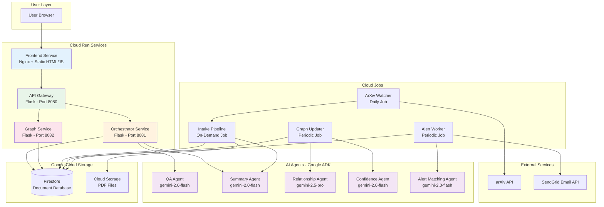
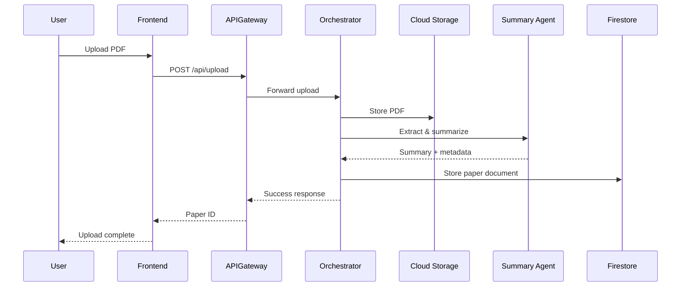
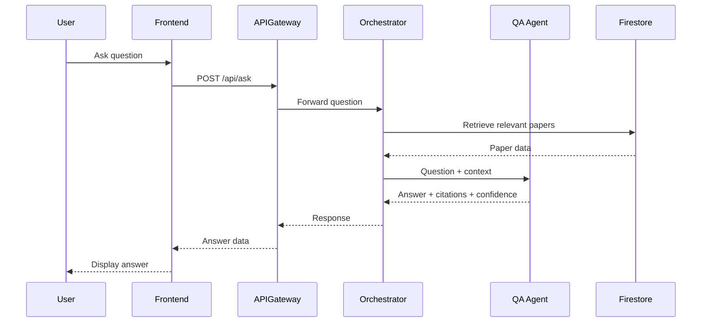
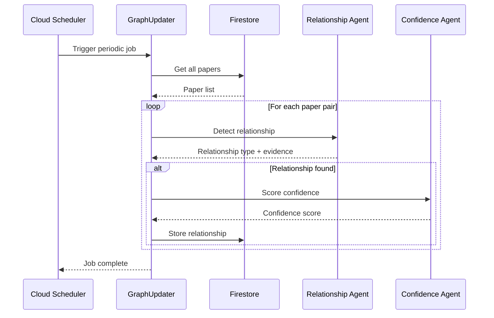
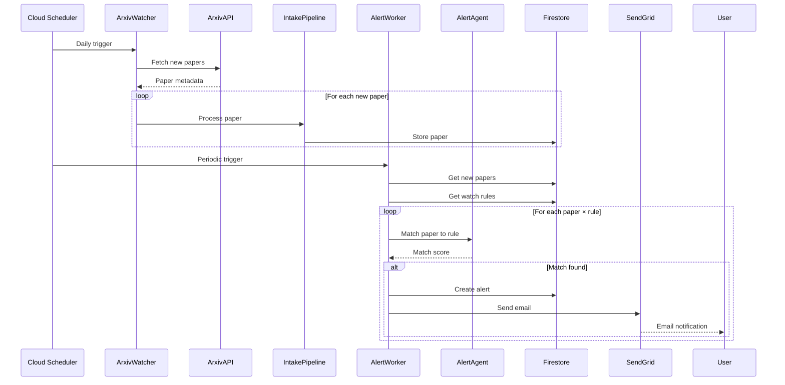
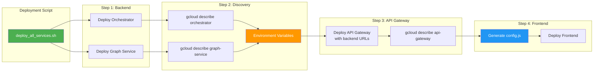
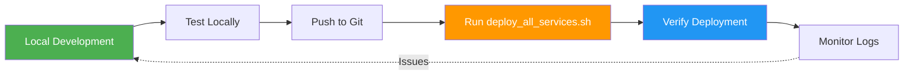

# Research Intelligence Platform - System Architecture

## Overview

The Research Intelligence Platform is a multi-agent AI system built on Google's Agent Development Kit (ADK) that automatically ingests, analyzes, and tracks research papers from arXiv. The system uses specialized AI agents for different tasks and is deployed as a fully serverless solution on Google Cloud Run.

## System Architecture



## Data Flow Diagrams

### 1. Paper Ingestion Flow



### 2. Question Answering Flow



### 3. Knowledge Graph Update Flow



### 4. Alert System Flow



## Component Details

### Cloud Run Services

#### 1. Frontend Service
- **Technology**: Nginx serving static HTML/CSS/JS
- **Purpose**: User interface for interacting with the platform
- **Features**:
  - Q&A interface
  - Paper corpus browser
  - Knowledge graph visualization
  - Watch rules management
  - Alert dashboard

#### 2. API Gateway
- **Technology**: Flask (Python)
- **Port**: 8080
- **Purpose**: Single entry point for all HTTP requests
- **Responsibilities**:
  - Request routing
  - Authentication (future)
  - Rate limiting (future)
  - Request/response logging
- **Environment Variables**:
  - `ORCHESTRATOR_URL`: URL of Orchestrator service
  - `GRAPH_SERVICE_URL`: URL of Graph Service
  - `GOOGLE_CLOUD_PROJECT`: GCP project ID

#### 3. Orchestrator Service
- **Technology**: Flask (Python)
- **Port**: 8081
- **Purpose**: Coordinates AI agents and business logic
- **Endpoints**:
  - `POST /qa`: Question answering
  - `GET /papers`: List papers
  - `POST /upload`: Upload PDF
- **Key Functions**:
  - Agent orchestration
  - Context retrieval from Firestore
  - Response synthesis

#### 4. Graph Service
- **Technology**: Flask (Python)
- **Port**: 8082
- **Purpose**: Knowledge graph operations
- **Endpoints**:
  - `GET /graph`: Get graph data
  - `GET /relationships`: List relationships
- **Data Structure**:
  - Nodes: Research papers
  - Edges: Relationships (supports, contradicts, extends)

### Cloud Jobs

#### 1. ArXiv Watcher
- **Schedule**: Daily
- **Purpose**: Monitor arXiv for new papers
- **Process**:
  1. Query arXiv API for papers in configured categories
  2. Check if paper already exists in Firestore
  3. Trigger intake pipeline for new papers

#### 2. Intake Pipeline
- **Trigger**: On-demand (from ArXiv Watcher or manual upload)
- **Purpose**: Process and ingest new papers
- **Process**:
  1. Download PDF from arXiv or accept upload
  2. Store in Cloud Storage
  3. Extract text using Summary Agent
  4. Generate summary and metadata
  5. Store in Firestore

#### 3. Graph Updater
- **Schedule**: Periodic (configurable)
- **Purpose**: Detect relationships between papers
- **Process**:
  1. Fetch all papers from Firestore
  2. Compare each paper pair using Relationship Agent
  3. Score confidence using Confidence Agent
  4. Store relationships in Firestore
- **Rate Limiting**: 60 requests/min to respect Gemini API limits

#### 4. Alert Worker
- **Schedule**: Periodic (e.g., hourly)
- **Purpose**: Match new papers to watch rules and send alerts
- **Process**:
  1. Fetch papers ingested since last run
  2. Fetch all active watch rules
  3. Match papers to rules using Alert Matching Agent
  4. Create alert records in Firestore
  5. Send email notifications via SendGrid

### AI Agents (Google ADK)

#### 1. QA Agent
- **Model**: gemini-2.0-flash-exp
- **Purpose**: Answer questions about research corpus
- **Input**: Question + relevant paper context
- **Output**: Answer + citations + confidence score
- **Features**:
  - Multi-document reasoning
  - Citation extraction
  - Confidence scoring

#### 2. Summary Agent
- **Model**: gemini-2.0-flash-exp
- **Purpose**: Extract and summarize paper content
- **Input**: PDF text or arXiv abstract
- **Output**:
  - Title
  - Authors
  - Abstract/Summary
  - Key findings
  - Methodology
- **Use Cases**:
  - Paper ingestion
  - Preview generation

#### 3. Relationship Agent
- **Model**: gemini-2.5-pro
- **Purpose**: Detect relationships between papers
- **Input**: Two paper summaries/abstracts
- **Output**:
  - Relationship type: supports, contradicts, extends, none
  - Evidence text
  - Relationship strength
- **Relationship Types**:
  - **Supports**: Validates or confirms findings
  - **Contradicts**: Disputes or challenges findings
  - **Extends**: Builds upon or expands findings

#### 4. Confidence Agent
- **Model**: gemini-2.0-flash-exp
- **Purpose**: Score confidence in detected relationships
- **Input**: Two papers + detected relationship + evidence
- **Output**: Confidence score (0.0 - 1.0)
- **Factors**:
  - Citation overlap
  - Methodological similarity
  - Temporal proximity
  - Author overlap

#### 5. Alert Matching Agent
- **Model**: gemini-2.0-flash-exp
- **Purpose**: Match papers to user-defined watch rules
- **Input**: Paper metadata + watch rule criteria
- **Output**: Match score + explanation
- **Rule Types**:
  - Keyword matching
  - Author tracking
  - Natural language claims

### Data Storage

#### Firestore Collections

```
research-intelligence/
├── papers/
│   └── {paper_id}
│       ├── paper_id: string
│       ├── title: string
│       ├── authors: string[]
│       ├── abstract: string
│       ├── summary: string
│       ├── arxiv_id: string
│       ├── pdf_url: string
│       ├── ingested_at: timestamp
│       └── metadata: object
│
├── relationships/
│   └── {relationship_id}
│       ├── source_paper_id: string
│       ├── target_paper_id: string
│       ├── relationship_type: enum(supports|contradicts|extends)
│       ├── confidence: float
│       ├── description: string
│       └── detected_at: timestamp
│
├── watch_rules/
│   └── {rule_id}
│       ├── rule_type: enum(keyword|author|claim)
│       ├── keywords: string[]  (for keyword rules)
│       ├── author_name: string  (for author rules)
│       ├── claim: string  (for claim rules)
│       ├── user_email: string
│       └── created_at: timestamp
│
└── alerts/
    └── {alert_id}
        ├── paper_id: string
        ├── rule_id: string
        ├── match_score: float
        ├── explanation: string
        ├── user_email: string
        ├── sent_at: timestamp
        └── status: enum(pending|sent|failed)
```

#### Cloud Storage Buckets

```
{project-id}-papers/
└── {paper_id}.pdf
```

## Deployment Architecture

### Service URLs (Auto-Discovered)



### Environment Variable Flow

```
1. Orchestrator deployed
   └─> URL: https://orchestrator-{hash}.{region}.run.app

2. Graph Service deployed
   └─> URL: https://graph-service-{hash}.{region}.run.app

3. API Gateway deployed with env vars:
   ├─> ORCHESTRATOR_URL=https://orchestrator-{hash}.{region}.run.app
   ├─> GRAPH_SERVICE_URL=https://graph-service-{hash}.{region}.run.app
   └─> GOOGLE_CLOUD_PROJECT=research-intel-agents

4. Frontend config.js generated:
   └─> API_BASE_URL=https://api-gateway-{hash}.{region}.run.app
```

## Key Design Decisions

### 1. Serverless Architecture
- **Decision**: Use Cloud Run for all services
- **Rationale**:
  - Auto-scaling from 0 to N instances
  - Pay-per-use pricing
  - No infrastructure management
  - Built-in load balancing

### 2. Multi-Agent Pattern
- **Decision**: Specialized agents for different tasks
- **Rationale**:
  - Domain-specific prompting improves accuracy
  - Independent scaling and model selection
  - Easier testing and debugging
  - Clear separation of concerns

### 3. Deployment-Time URL Discovery
- **Decision**: Discover service URLs during deployment, not runtime
- **Rationale**:
  - Cloud Run URLs change on redeployment
  - Runtime discovery requires gcloud CLI in containers
  - Deployment-time discovery is simpler and more reliable
  - Environment variables are Cloud Run best practice

### 4. Relationship Detection as Batch Job
- **Decision**: Run relationship detection periodically, not on ingestion
- **Rationale**:
  - O(n²) complexity for n papers
  - Long-running process unsuitable for synchronous API
  - Allows for rate limiting and cost control
  - Can be scheduled during low-usage periods

### 5. Frontend as Static Files
- **Decision**: Serve frontend as static HTML/CSS/JS
- **Rationale**:
  - Fast deployment (no build step)
  - Low resource usage
  - Simple debugging
  - Cloud Run can efficiently serve static content

## Security Considerations

### Current State
- All Cloud Run services allow unauthenticated access
- No API authentication or rate limiting
- Suitable for demo/hackathon purposes

### Production Recommendations
1. **Authentication**:
   - Enable Cloud Run IAM authentication
   - Implement JWT-based API auth
   - Add user management system

2. **Rate Limiting**:
   - Add rate limiting at API Gateway
   - Implement per-user quotas
   - Protect against abuse

3. **Data Security**:
   - Encrypt Firestore data at rest (enabled by default)
   - Use VPC connectors for private networking
   - Implement CORS policies

4. **Secret Management**:
   - Move API keys to Secret Manager
   - Rotate credentials regularly
   - Use least-privilege IAM roles

## Monitoring and Observability

### Cloud Run Metrics
- Request count
- Request latency
- Instance count
- CPU utilization
- Memory usage

### Custom Metrics (Future)
- Papers ingested per day
- Relationships detected per run
- Alerts sent per hour
- QA query latency
- Agent invocation counts

### Logging
- Structured JSON logging
- Log levels: INFO, WARNING, ERROR
- Correlation IDs for request tracing
- Cloud Logging integration

## Cost Optimization

### Current Approach
1. **Pre-built Base Image**:
   - Avoids rebuilding dependencies on each deployment
   - Reduces build time from 15-20 min to 1-2 min

2. **Model Selection**:
   - gemini-2.0-flash for most tasks (cost-effective)
   - gemini-2.5-pro only for complex relationship detection

3. **Batch Processing**:
   - Relationship detection runs periodically, not per-paper
   - Configurable schedules to control frequency

4. **Auto-scaling**:
   - Cloud Run scales to zero when idle
   - No cost for unused capacity

### Future Optimizations
1. **Caching**:
   - Cache QA responses for common questions
   - Cache paper summaries and embeddings

2. **Smart Triggering**:
   - Only run graph updates when new papers arrive
   - Incremental relationship detection

3. **Resource Limits**:
   - Configure CPU/memory limits per service
   - Use smaller instances where possible

## Development Workflow



### Local Testing
```bash
# Set environment variables
export GOOGLE_CLOUD_PROJECT=research-intel-agents
export PORT=8081

# Run service locally
python -m src.services.orchestrator.main
```

### Deployment
```bash
# Deploy all services with automatic URL discovery
bash scripts/deploy_all_services.sh
```

### Verification
```bash
# Test API Gateway
curl https://api-gateway-{hash}.{region}.run.app/health

# Test QA endpoint
curl -X POST https://api-gateway-{hash}.{region}.run.app/api/ask \
  -H "Content-Type: application/json" \
  -d '{"question": "What is the Transformer architecture?"}'
```

## Future Enhancements

### Phase 4: Advanced Features
1. **Paper Recommendations**:
   - Suggest papers based on user interests
   - Collaborative filtering

2. **Citation Network Analysis**:
   - Visualize citation networks
   - Identify influential papers

3. **Trend Detection**:
   - Identify emerging research trends
   - Track topic evolution over time

4. **Multi-Modal Support**:
   - Process figures and equations
   - Video lecture integration

### Phase 5: Scale and Performance
1. **Vector Search**:
   - Vertex AI Vector Search for semantic similarity
   - Faster paper retrieval

2. **Streaming Responses**:
   - Stream QA responses for better UX
   - Server-Sent Events (SSE)

3. **Distributed Processing**:
   - Parallel relationship detection
   - Distributed graph computation

4. **Advanced Caching**:
   - Redis for hot data
   - CDN for frontend assets

---

**Last Updated**: 2025-01-05
**Version**: 1.0
**Status**: Production-ready for hackathon demo
