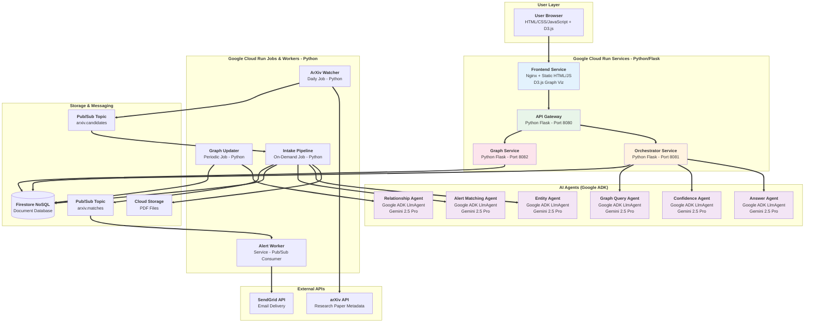
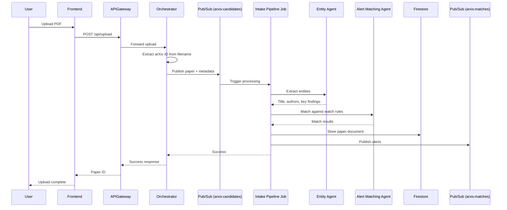
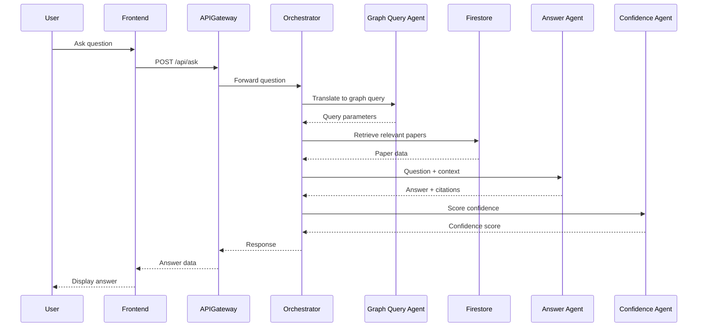
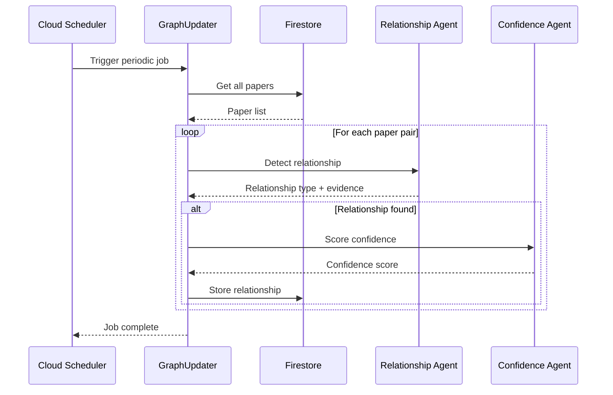
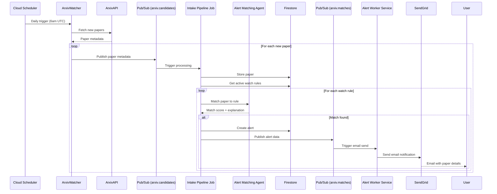
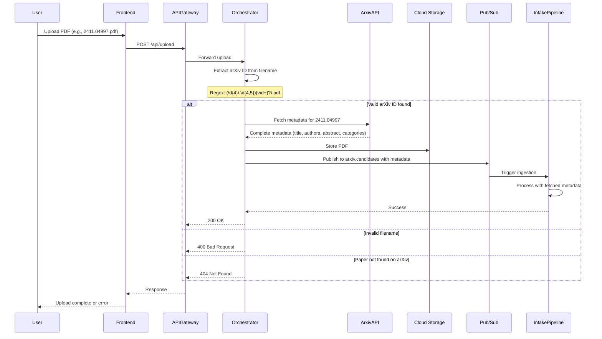
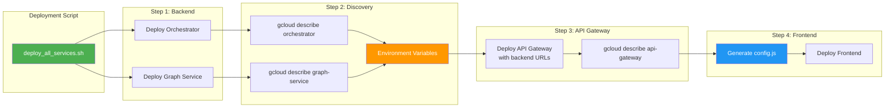
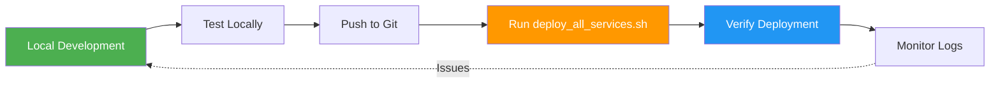

# Research Intelligence Platform - System Architecture

## Overview

The Research Intelligence Platform is a multi-agent AI system built on Google's Agent Development Kit (ADK) that automatically ingests, analyzes, and tracks research papers from arXiv. The system uses specialized AI agents for different tasks and is deployed as a fully serverless solution on Google Cloud Run.

## System Architecture

**Technologies**: Google Cloud Run, Python, Flask, Nginx, D3.js, Google ADK, Gemini 2.5 Pro, Firestore, Cloud Storage, Pub/Sub, SendGrid



## Data Flow Diagrams

### 1. Paper Ingestion Flow



### 2. Question Answering Flow



### 3. Knowledge Graph Update Flow



### 4. Alert System Flow



### 5. Manual Upload Flow with arXiv Metadata



**Key Features**:
- Automatic arXiv ID extraction from filename using regex pattern `(\d{4}\.\d{4,5})(v\d+)?\.pdf`
- Fetches complete metadata from arXiv API using `arxiv` Python library
- Retrieves: title, authors, abstract, categories, primary_category, published date, updated date, PDF URL
- Error handling:
  - Returns 400 if filename doesn't match arXiv pattern
  - Returns 404 if paper not found on arXiv
  - Returns 500 for arXiv API failures
- Uses fetched metadata instead of PDF extraction for faster ingestion
- Entity Agent still performs additional extraction and category inference

**Implementation Files**:
- `src/services/orchestrator/main.py` (lines 213-338): Upload endpoint
- `src/utils/arxiv_fetcher.py`: arXiv ID extraction and API fetching
- `src/pipelines/ingestion_pipeline.py` (lines 317-330): Enhanced alert data generation

## Component Details

### Cloud Run Services

#### 1. Frontend Service
- **Technology**: Nginx serving static HTML/CSS/JS
- **Purpose**: User interface for interacting with the platform
- **Features**:
  - Q&A interface
  - Paper corpus browser
  - Knowledge graph visualization
  - Watch rules management
  - Alert dashboard

#### 2. API Gateway
- **Technology**: Flask (Python)
- **Port**: 8080
- **Purpose**: Single entry point for all HTTP requests
- **Responsibilities**:
  - Request routing
  - Authentication (future)
  - Rate limiting (future)
  - Request/response logging
- **Environment Variables**:
  - `ORCHESTRATOR_URL`: URL of Orchestrator service
  - `GRAPH_SERVICE_URL`: URL of Graph Service
  - `GOOGLE_CLOUD_PROJECT`: GCP project ID
  - `GOOGLE_API_KEY`: Gemini API key (for agent operations)
  - `DEFAULT_MODEL`: Model to use (default: gemini-2.5-pro)
  - `FROM_EMAIL`: Email address for alert notifications
  - `SENDGRID_API_KEY`: SendGrid API key (optional, for email delivery)

#### 3. Orchestrator Service
- **Technology**: Flask (Python)
- **Port**: 8081
- **Purpose**: Coordinates AI agents and business logic
- **Endpoints**:
  - `POST /qa`: Question answering
  - `GET /papers`: List papers
  - `POST /upload`: Upload PDF
- **Key Functions**:
  - Agent orchestration
  - Context retrieval from Firestore
  - Response synthesis

#### 4. Graph Service
- **Technology**: Flask (Python)
- **Port**: 8082
- **Purpose**: Knowledge graph operations
- **Endpoints**:
  - `GET /graph`: Get graph data
  - `GET /relationships`: List relationships
- **Data Structure**:
  - Nodes: Research papers
  - Edges: Relationships (supports, contradicts, extends)

### Cloud Jobs

#### 1. ArXiv Watcher
- **Schedule**: Daily
- **Purpose**: Monitor arXiv for new papers
- **Process**:
  1. Query arXiv API for papers in configured categories
  2. Check if paper already exists in Firestore
  3. Trigger intake pipeline for new papers

#### 2. Intake Pipeline
- **Trigger**: On-demand (from ArXiv Watcher or manual upload)
- **Purpose**: Process and ingest new papers
- **Process**:
  1. Download PDF from arXiv or accept upload
  2. Store in Cloud Storage
  3. Extract text using Summary Agent
  4. Generate summary and metadata
  5. Store in Firestore

#### 3. Graph Updater
- **Schedule**: Periodic (configurable)
- **Purpose**: Detect relationships between papers
- **Process**:
  1. Fetch all papers from Firestore
  2. Compare each paper pair using Relationship Agent
  3. Score confidence using Confidence Agent
  4. Store relationships in Firestore
- **Rate Limiting**: 60 requests/min to respect Gemini API limits

#### 4. Alert Worker
- **Architecture**: Cloud Run Service with Pub/Sub push subscription
- **Pub/Sub Topic**: `arxiv.matches`
- **Trigger**: Push subscription from Pub/Sub when alerts are created
- **Purpose**: Send email notifications for paper matches
- **Process**:
  1. Receive push notification from Pub/Sub with alert data
  2. Parse alert data from message payload
  3. Generate enhanced email with:
     - Category-specific subject line
     - Match confidence percentage (color-coded)
     - Key findings excerpt (truncated to 300 chars)
     - Category name mapping (cs.AI → Artificial Intelligence)
     - arXiv paper link
  4. Send email via SendGrid API
  5. Fallback to logging if SendGrid not configured
  6. Return 200 OK on success, 500 on failure (Pub/Sub retries)
- **Email Features**:
  - HTML and plain text versions
  - Confidence color coding: green (≥70%), orange (50-69%), gray (<50%)
  - Direct arXiv paper links
  - Unsubscribe information
- **Note**: Alert matching is done by Intake Pipeline, not Alert Worker

### AI Agents (Google ADK)

All agents use Google ADK primitives (LlmAgent, Runner, InMemorySessionService) and are ADK-compliant. The platform uses **6 specialized AI agents**:

#### 1. Entity Agent
- **Model**: gemini-2.5-pro (configurable via DEFAULT_MODEL)
- **Purpose**: Extract entities and metadata from papers
- **Input**: PDF text or arXiv abstract
- **Output**:
  - Title
  - Authors
  - Abstract/Summary
  - Key findings
  - Methods used
  - Datasets mentioned
  - Inferred arXiv category (LLM-based inference)
- **Use Cases**:
  - Paper ingestion
  - Metadata enrichment

#### 2. Relationship Agent
- **Model**: gemini-2.5-pro (configurable via DEFAULT_MODEL)
- **Purpose**: Detect relationships between papers
- **Input**: Two paper summaries/abstracts
- **Output**:
  - Relationship type: extends, supports, contradicts, cites, builds_on, applies
  - Evidence text
  - Relationship strength
- **Relationship Types**:
  - **Extends**: Builds upon or expands findings
  - **Supports**: Validates or confirms findings
  - **Contradicts**: Disputes or challenges findings
  - **Cites**: References another paper
  - **Builds_on**: Uses methods or ideas from another paper
  - **Applies**: Applies techniques from another domain

#### 3. Answer Agent
- **Model**: gemini-2.5-pro (configurable via DEFAULT_MODEL)
- **Purpose**: Answer questions about research corpus
- **Input**: Question + relevant paper context
- **Output**: Answer with citations to source papers
- **Features**:
  - Multi-document reasoning
  - Citation extraction
  - Context-aware responses

#### 4. Confidence Agent
- **Model**: gemini-2.5-pro (configurable via DEFAULT_MODEL)
- **Purpose**: Score confidence in Q&A answers
- **Input**: Question + answer + paper context
- **Output**: Confidence score (0.0 - 1.0)
- **Factors**:
  - Source paper relevance
  - Answer completeness
  - Evidence strength
  - Citation quality

#### 5. Graph Query Agent
- **Model**: gemini-2.5-pro (configurable via DEFAULT_MODEL)
- **Purpose**: Translate natural language to graph queries
- **Input**: Natural language question + graph schema
- **Output**: Structured graph query parameters
- **Features**:
  - Identifies relevant relationship types
  - Determines traversal depth
  - Extracts entity names and constraints
- **Use Cases**:
  - "Show papers that extend X"
  - "Find contradictions to Y"
  - "Papers influenced by Z"

#### 6. Alert Matching Agent (ClaimMatcher)
- **Model**: gemini-2.5-pro (configurable via DEFAULT_MODEL)
- **Purpose**: Match papers to user-defined watch rules
- **Input**: Paper metadata + watch rule criteria
- **Output**: Match score (0.0-1.0) + explanation
- **Rule Types**:
  - **Claim-based**: Natural language claims (e.g., "papers claiming MMLU improvements >2%")
  - **Keyword**: Keyword matching with semantic understanding
  - **Author**: Author name tracking
  - **Relationship**: Papers with specific relationship types

### Data Storage

#### Firestore Collections

```
research-intelligence/
├── papers/
│   └── {paper_id}
│       ├── paper_id: string
│       ├── title: string
│       ├── authors: string[]
│       ├── abstract: string
│       ├── summary: string
│       ├── arxiv_id: string
│       ├── pdf_url: string
│       ├── ingested_at: timestamp
│       └── metadata: object
│
├── relationships/
│   └── {relationship_id}
│       ├── source_paper_id: string
│       ├── target_paper_id: string
│       ├── relationship_type: enum(supports|contradicts|extends)
│       ├── confidence: float
│       ├── description: string
│       └── detected_at: timestamp
│
├── watch_rules/
│   └── {rule_id}
│       ├── name: string
│       ├── rule_type: enum(claim|keyword|author|relationship|template)
│       ├── claim_description: string  # for claim rules
│       ├── keywords: string[]  # for keyword rules
│       ├── authors: string[]  # for author rules (array instead of single)
│       ├── user_email: string  # defaults to FROM_EMAIL if not provided
│       ├── user_name: string
│       ├── active: boolean
│       └── created_at: timestamp
│
└── alerts/
    └── {alert_id}
        ├── paper_id: string
        ├── rule_id: string
        ├── match_score: float
        ├── match_reason: string  # renamed from explanation
        ├── user_email: string
        ├── user_name: string  # NEW
        ├── paper_title: string  # NEW
        ├── paper_authors: string[]  # NEW
        ├── arxiv_id: string  # NEW
        ├── primary_category: string  # NEW
        ├── key_finding: string  # NEW
        ├── sent_at: timestamp
        └── status: enum(pending|sent|failed)
```

#### Cloud Storage Buckets

```
{project-id}-papers/
└── {paper_id}.pdf
```

## Deployment Architecture

### Service URLs (Auto-Discovered)



### Environment Variable Flow

```
1. Orchestrator deployed
   └─> URL: https://orchestrator-{hash}.{region}.run.app

2. Graph Service deployed
   └─> URL: https://graph-service-{hash}.{region}.run.app

3. API Gateway deployed with env vars:
   ├─> ORCHESTRATOR_URL=https://orchestrator-{hash}.{region}.run.app
   ├─> GRAPH_SERVICE_URL=https://graph-service-{hash}.{region}.run.app
   └─> GOOGLE_CLOUD_PROJECT=research-intel-agents

4. Frontend config.js generated:
   └─> API_BASE_URL=https://api-gateway-{hash}.{region}.run.app
```

## Key Design Decisions

### 1. Serverless Architecture
- **Decision**: Use Cloud Run for all services
- **Rationale**:
  - Auto-scaling from 0 to N instances
  - Pay-per-use pricing
  - No infrastructure management
  - Built-in load balancing

### 2. Multi-Agent Pattern
- **Decision**: Specialized agents for different tasks
- **Rationale**:
  - Domain-specific prompting improves accuracy
  - Independent scaling and model selection
  - Easier testing and debugging
  - Clear separation of concerns

### 3. Deployment-Time URL Discovery
- **Decision**: Discover service URLs during deployment, not runtime
- **Rationale**:
  - Cloud Run URLs change on redeployment
  - Runtime discovery requires gcloud CLI in containers
  - Deployment-time discovery is simpler and more reliable
  - Environment variables are Cloud Run best practice

### 4. Relationship Detection as Batch Job
- **Decision**: Run relationship detection periodically, not on ingestion
- **Rationale**:
  - O(n²) complexity for n papers
  - Long-running process unsuitable for synchronous API
  - Allows for rate limiting and cost control
  - Can be scheduled during low-usage periods

### 5. Frontend as Static Files
- **Decision**: Serve frontend as static HTML/CSS/JS
- **Rationale**:
  - Fast deployment (no build step)
  - Low resource usage
  - Simple debugging
  - Cloud Run can efficiently serve static content

## Security Considerations

### Current State
- All Cloud Run services allow unauthenticated access
- No API authentication or rate limiting
- Suitable for demo/hackathon purposes

### Production Recommendations
1. **Authentication**:
   - Enable Cloud Run IAM authentication
   - Implement JWT-based API auth
   - Add user management system

2. **Rate Limiting**:
   - Add rate limiting at API Gateway
   - Implement per-user quotas
   - Protect against abuse

3. **Data Security**:
   - Encrypt Firestore data at rest (enabled by default)
   - Use VPC connectors for private networking
   - Implement CORS policies

4. **Secret Management**:
   - Move API keys to Secret Manager
   - Rotate credentials regularly
   - Use least-privilege IAM roles

## Monitoring and Observability

### Cloud Run Metrics
- Request count
- Request latency
- Instance count
- CPU utilization
- Memory usage

### Custom Metrics (Future)
- Papers ingested per day
- Relationships detected per run
- Alerts sent per hour
- QA query latency
- Agent invocation counts

### Logging
- Structured JSON logging
- Log levels: INFO, WARNING, ERROR
- Correlation IDs for request tracing
- Cloud Logging integration

## Cost Optimization

### Current Approach
1. **Pre-built Base Image**:
   - Avoids rebuilding dependencies on each deployment
   - Reduces build time from 15-20 min to 1-2 min

2. **Model Selection**:
   - gemini-2.5-pro for all agents (configurable via DEFAULT_MODEL in .env)
   - Provides best quality results for hackathon demo
   - Can be changed to gemini-2.0-flash-exp for cost optimization in production

3. **Batch Processing**:
   - Relationship detection runs periodically, not per-paper
   - Configurable schedules to control frequency

4. **Auto-scaling**:
   - Cloud Run scales to zero when idle
   - No cost for unused capacity

### Future Optimizations
1. **Caching**:
   - Cache QA responses for common questions
   - Cache paper summaries and embeddings

2. **Smart Triggering**:
   - Only run graph updates when new papers arrive
   - Incremental relationship detection

3. **Resource Limits**:
   - Configure CPU/memory limits per service
   - Use smaller instances where possible

## Development Workflow



### Local Testing
```bash
# Set environment variables
export GOOGLE_CLOUD_PROJECT=research-intel-agents
export PORT=8081

# Run service locally
python -m src.services.orchestrator.main
```

### Deployment
```bash
# Deploy all services with automatic URL discovery
bash scripts/deploy_all_services.sh
```

### Verification
```bash
# Test API Gateway
curl https://api-gateway-{hash}.{region}.run.app/health

# Test QA endpoint
curl -X POST https://api-gateway-{hash}.{region}.run.app/api/ask \
  -H "Content-Type: application/json" \
  -d '{"question": "What is the Transformer architecture?"}'
```

## Future Enhancements

### Phase 4: Advanced Features
1. **Paper Recommendations**:
   - Suggest papers based on user interests
   - Collaborative filtering

2. **Citation Network Analysis**:
   - Visualize citation networks
   - Identify influential papers

3. **Trend Detection**:
   - Identify emerging research trends
   - Track topic evolution over time

4. **Multi-Modal Support**:
   - Process figures and equations
   - Video lecture integration

### Phase 5: Scale and Performance
1. **Vector Search**:
   - Vertex AI Vector Search for semantic similarity
   - Faster paper retrieval

2. **Streaming Responses**:
   - Stream QA responses for better UX
   - Server-Sent Events (SSE)

3. **Distributed Processing**:
   - Parallel relationship detection
   - Distributed graph computation

4. **Advanced Caching**:
   - Redis for hot data
   - CDN for frontend assets

---

**Last Updated**: 2025-01-05
**Version**: 1.0
**Status**: Production-ready for hackathon demo
