# Research Intelligence Platform - Architecture Document

**Project**: Google Cloud Run Hackathon - AI Agents Category
**Last Updated**: 2025-10-27
**Status**: Design Phase

---

## Table of Contents

1. [Executive Summary](#executive-summary)
2. [System Architecture Overview](#system-architecture-overview)
3. [Multi-Agent System Design](#multi-agent-system-design)
4. [Data Architecture](#data-architecture)
5. [Cloud Run Deployment Architecture](#cloud-run-deployment-architecture)
6. [API Specifications](#api-specifications)
7. [Security & Scalability](#security--scalability)
8. [Technology Stack](#technology-stack)

---

## Executive Summary

### What We're Building

A **Research Intelligence Platform** that uses Google ADK multi-agent systems to:
- Monitor arXiv for new papers 24/7
- Build a knowledge graph showing paper relationships (supports, contradicts, extends)
- Proactively alert researchers to relevant publications
- Answer questions with citations and confidence scores

### Core Value Proposition

> "Researchers save 4.5 hours/week on literature review. The system finds you—you don't search."

### Technical Highlights

- **7 specialized AI agents** orchestrated with Google ADK
- **All 3 Cloud Run resource types**: Services (4), Jobs (5), Workers (1)
- **Knowledge graph** with relationship detection
- **Proactive intelligence**, not just reactive Q&A
- **Trust mechanisms**: contradiction detection, confidence scoring, citation verification

---

## System Architecture Overview

### High-Level Architecture

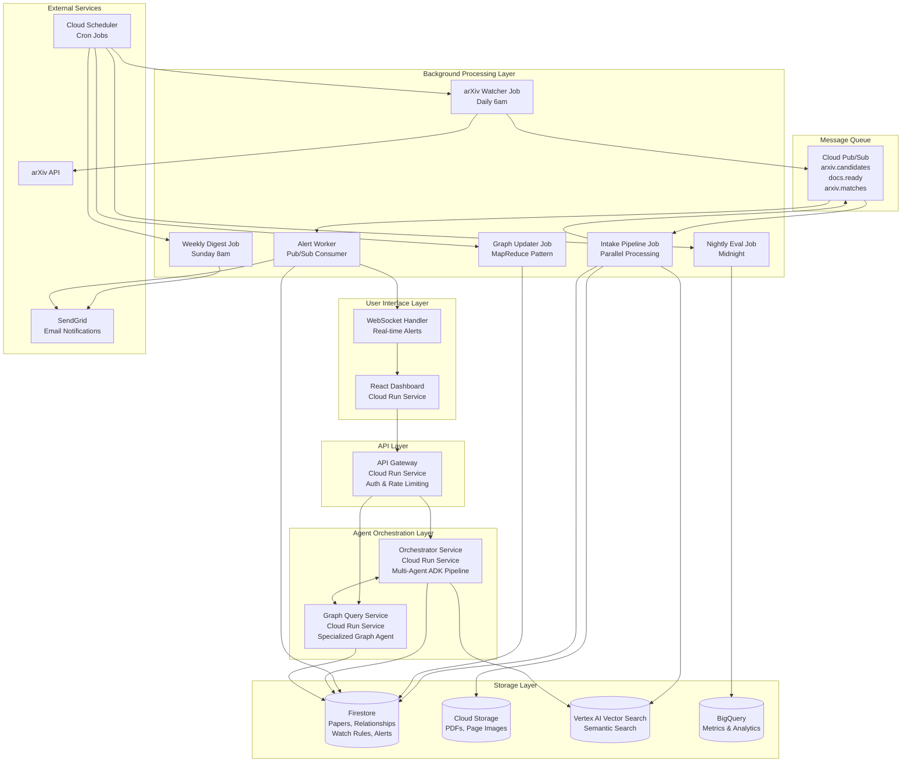

### Data Flow: End-to-End Request

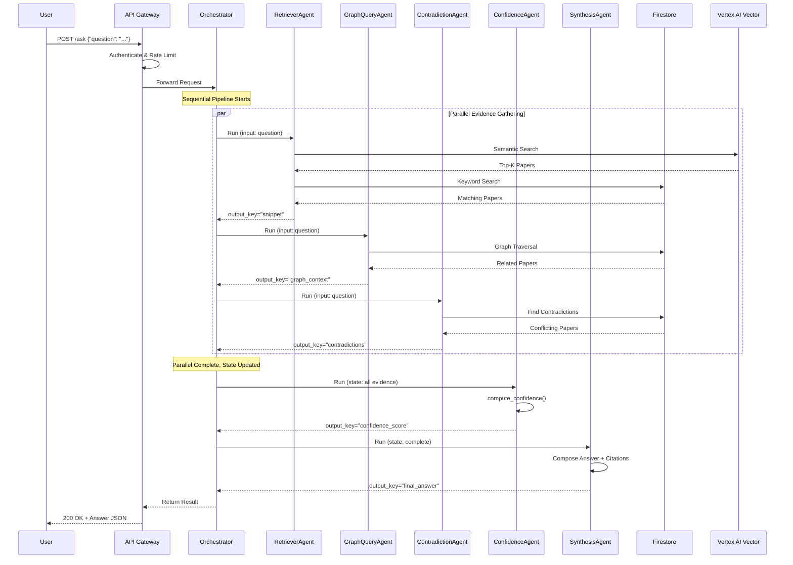

### Proactive Alerting Flow

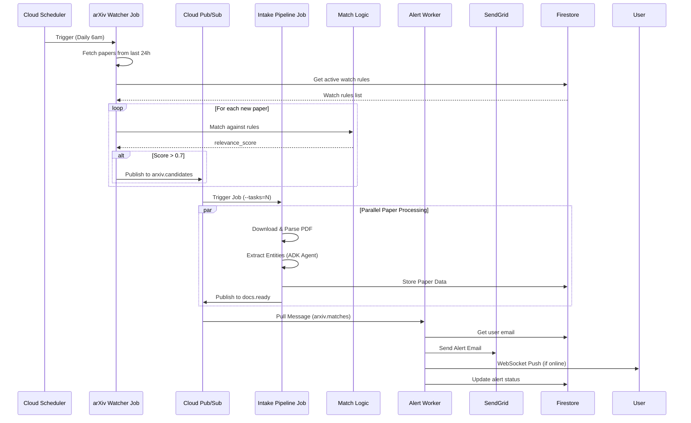

---

## Multi-Agent System Design

### Agent Architecture

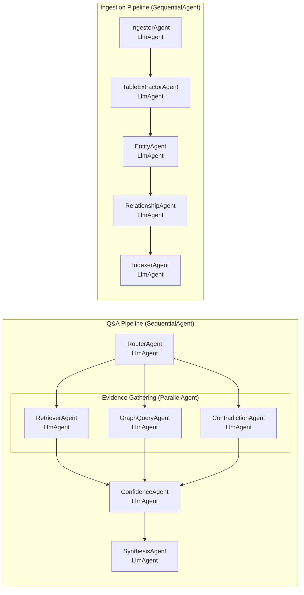

### Agent Details & Communication

#### 1. RouterAgent (Entry Point)

**Type**: `LlmAgent`
**Model**: `gemini-2.0-flash-exp`
**Purpose**: Classify query type and route to specialists

**ADK Implementation**:
```python
router_agent = LlmAgent(
    name="RouterAgent",
    model="gemini-2.0-flash-exp",
    description="Routes questions to specialized agents",
    instruction="""
    Classify the question type:
    - NUMERIC_QUERY: "What was the accuracy?"
    - COMPARISON_QUERY: "Which is better, X or Y?"
    - CONCEPTUAL_QUERY: "How does diffusion work?"
    - DISCOVERY_QUERY: "Has anyone tried X?"

    Extract key entities and route appropriately.
    """,
    tools=[extract_entities_from_query],
    output_key="routing_decision"
)
```

**Communication Pattern**: Hierarchical delegation via agent-as-tool

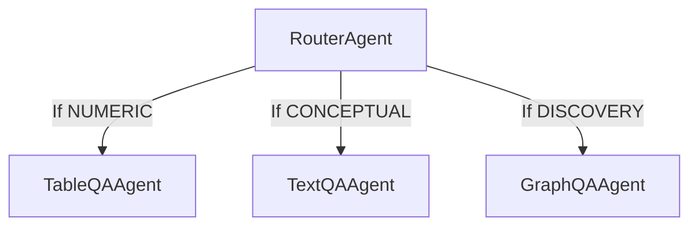

#### 2. Evidence Gathering (Parallel)

**Type**: `ParallelAgent` (runs 3 agents concurrently)

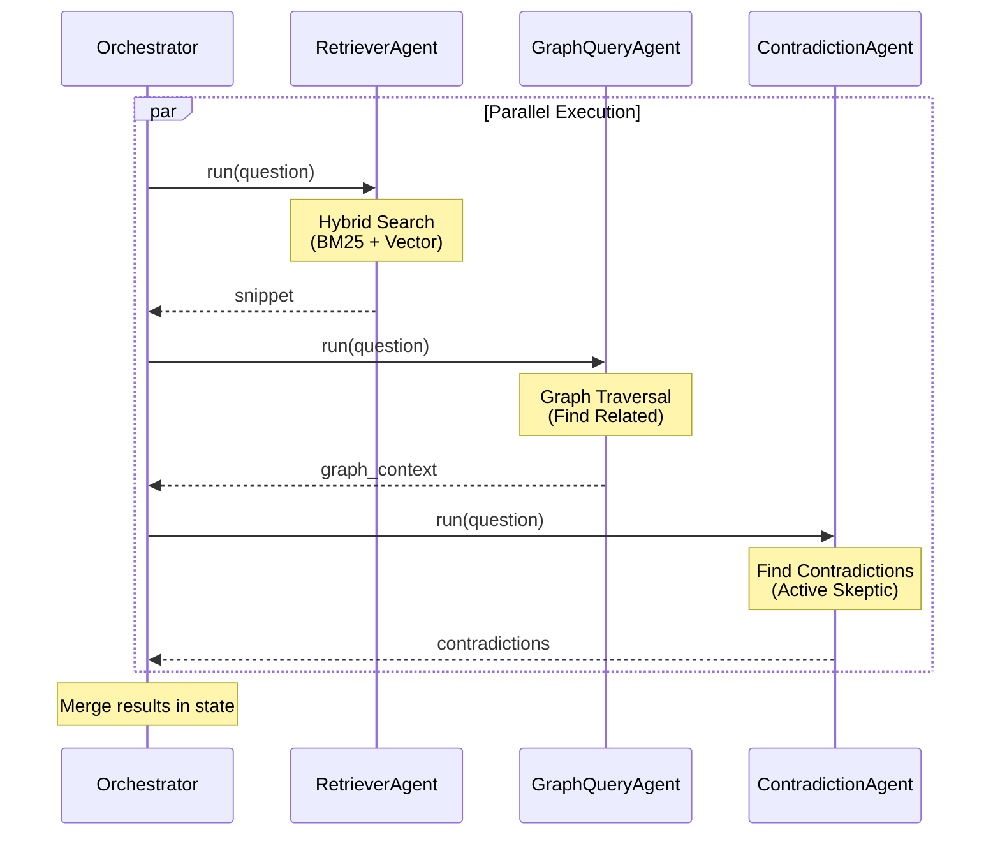

**RetrieverAgent**:
```python
retriever_agent = LlmAgent(
    name="RetrieverAgent",
    model="gemini-2.0-flash-exp",
    instruction="Use hybrid_search to find relevant papers",
    tools=[
        keyword_search,    # BM25
        vector_search,     # Semantic
        reciprocal_rank_fusion  # Merge
    ],
    output_key="snippet"
)
```

**GraphQueryAgent**:
```python
graph_agent = LlmAgent(
    name="GraphQueryAgent",
    model="gemini-2.0-flash-exp",
    instruction="Explore knowledge graph for context",
    tools=[
        graph_lookup_papers,       # Find papers by entity
        graph_find_relationships,  # Get edges
        graph_traverse,            # Multi-hop
        graph_get_cluster          # Controversy clusters
    ],
    output_key="graph_context"
)
```

**ContradictionAgent**:
```python
contradiction_agent = LlmAgent(
    name="ContradictionAgent",
    model="gemini-2.0-flash-exp",
    instruction="""
    You are a scientific skeptic. Search for papers that:
    1. Report contradicting findings
    2. Show null results
    3. Criticize methodology

    Be thorough but fair.
    """,
    tools=[find_contradictions, search_null_results],
    output_key="contradictions"
)
```

#### 3. ConfidenceAgent (Quality Scorer)

**Algorithm**:
```python
def compute_confidence(context: dict) -> float:
    score = 0.5  # Base

    # More supporting papers = higher confidence
    support_bonus = min(0.3, 0.05 * context['support_count'])

    # Contradictions = lower confidence
    contradiction_penalty = 0.2 * context['contradiction_count']

    # Data quality matters
    quality_bonus = 0.1 if context['has_table_data'] else 0

    # Recency matters
    recency_bonus = 0.1 if context['avg_year'] >= 2023 else 0

    confidence = score + support_bonus - contradiction_penalty \
                 + quality_bonus + recency_bonus

    return max(0.0, min(1.0, confidence))
```

**Thresholds**:
- `>0.8`: High confidence, answer directly
- `0.5-0.8`: Moderate confidence, include caveats
- `<0.5`: Low confidence, suggest need for more data

#### 4. SynthesisAgent (Answer Composer)

**Input State**:
```json
{
  "routing_decision": {...},
  "snippet": "Paper A found 15% improvement [Table 2]",
  "graph_context": {
    "related_papers": 5,
    "supports": 3,
    "contradicts": 1
  },
  "contradictions": ["Paper D reported only 0.2%"],
  "confidence_score": 0.75
}
```

**Output Format**:
```
[Direct Answer]
Drug X reduced HbA1c by 0.5% at 12 weeks [Paper A, Table 2].

[Supporting Evidence]
This finding is supported by two additional RCTs [Paper B, Paper C].

[Nuance/Caveats]
Note: Paper D reported only 0.2% reduction, but used lower dosage.

[Confidence]
Confidence: 0.75 (Moderate-High)
Based on 3 supporting studies, 1 contradicting study.
```

**Critical Rule**: Every factual claim must have `[Source]` citation

### Agent Communication Patterns

#### Pattern 1: Sequential Coordination
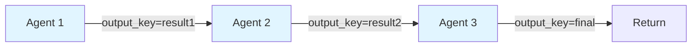

**ADK Code**:
```python
pipeline = SequentialAgent(
    name="Pipeline",
    sub_agents=[agent1, agent2, agent3],
    description="Fixed sequential flow"
)
```

#### Pattern 2: Parallel Consultation
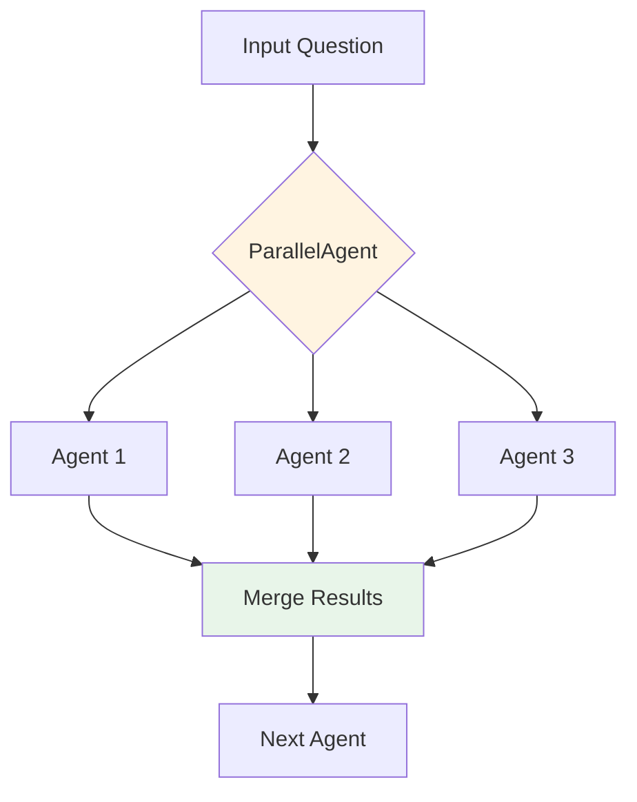

**ADK Code**:
```python
parallel_step = ParallelAgent(
    name="EvidenceGathering",
    sub_agents=[retriever, graph_query, contradiction],
    description="Gather evidence simultaneously"
)
```

#### Pattern 3: Feedback Loop
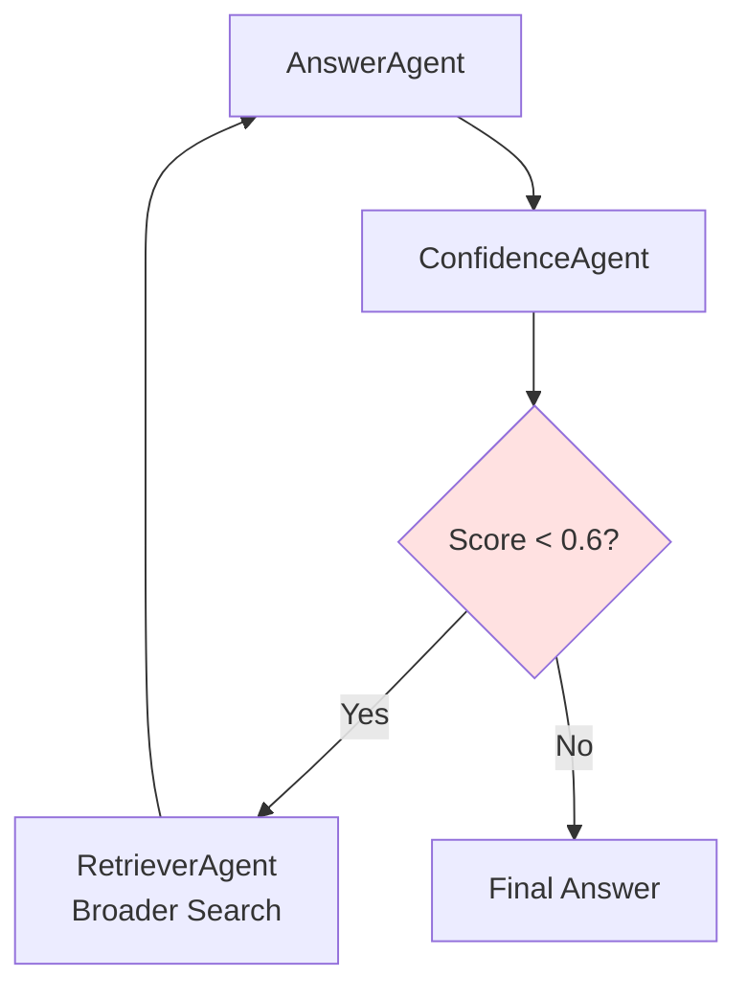

**ADK Code** (Custom):
```python
class AdaptiveQAPipeline(CustomAgent):
    def run(self, input):
        # First pass
        result = qa_pipeline.run(input)

        # Check confidence
        if result['confidence_score'] < 0.6:
            # Re-run with broader search
            enhanced_input = {**input, 'search_mode': 'broad', 'k': 10}
            result = qa_pipeline.run(enhanced_input)

        return result
```

#### Pattern 4: Event-Driven
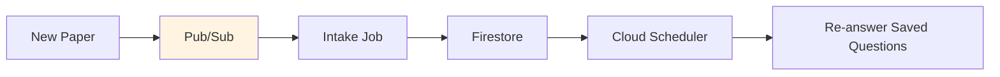

### Ingestion Pipeline (Background)

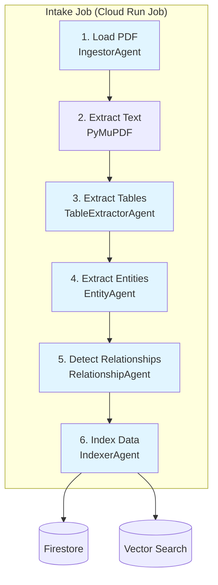

**ADK Implementation**:
```python
ingestion_pipeline = SequentialAgent(
    name="IngestionPipeline",
    sub_agents=[
        ingestor_agent,        # Load PDF
        table_extractor_agent, # Extract tables
        entity_agent,          # Extract methods, findings
        relationship_agent,    # Compare to existing papers
        indexer_agent          # Store in Firestore + Vector DB
    ],
    description="Process new papers end-to-end"
)
```

---

## Data Architecture

### Firestore Schema

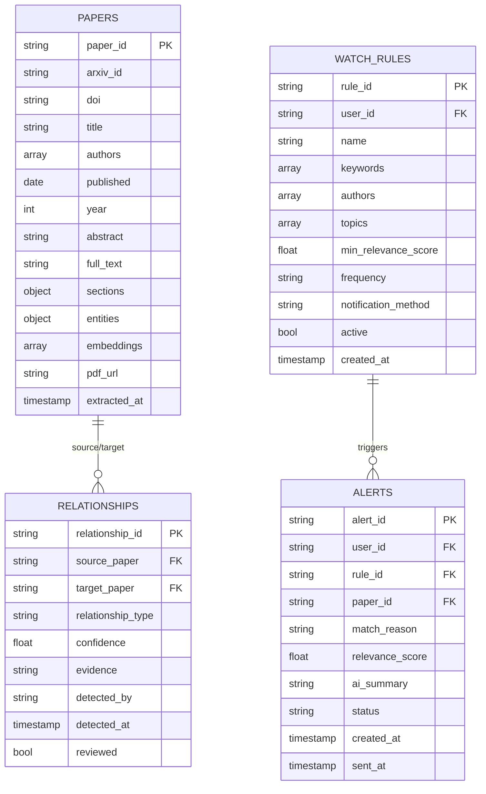

### Entity Extraction Schema

**papers/ collection**:
```javascript
{
  // Primary identifiers
  paper_id: "arxiv:2310.12345",
  arxiv_id: "2310.12345",
  doi: "10.1234/example",

  // Metadata
  title: "Diffusion Models for Sim-to-Real Transfer",
  authors: ["Smith, J.", "Lee, K.", "Chen, M."],
  published: "2023-10-15",
  year: 2023,

  // Content
  abstract: "...",
  full_text: "...",
  sections: {
    introduction: "...",
    methods: "...",
    results: "...",
    discussion: "...",
    conclusion: "..."
  },

  // Extracted entities (by EntityAgent)
  entities: {
    methods: [
      "diffusion_models",
      "reinforcement_learning",
      "domain_randomization"
    ],
    findings: [
      "15%_improvement_rigid_objects",
      "works_poorly_on_deformables"
    ],
    datasets: ["robomimic", "metaworld", "d4rl"],
    metrics: {
      "success_rate": 0.87,
      "sample_efficiency": "50k_steps"
    }
  },

  // For retrieval
  embeddings: {
    abstract: [0.123, 0.456, ...],  // 768-dim
    results_section: [0.789, ...]
  },

  // Processing metadata
  pdf_url: "gs://bucket/pdfs/2310.12345.pdf",
  extracted_at: timestamp,
  extraction_version: "v1.2"
}
```

### Relationship Types & Detection

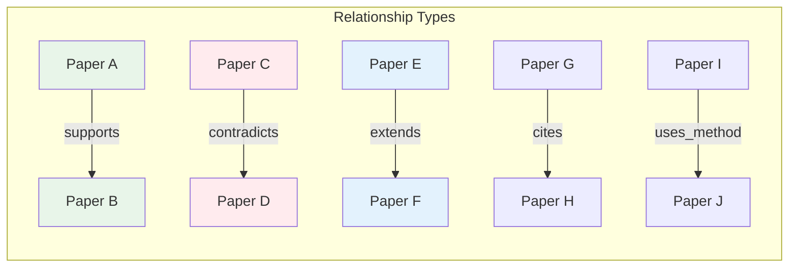

**relationships/ collection**:
```javascript
{
  relationship_id: "rel_20231015_001",
  source_paper: "arxiv:2310.12345",
  target_paper: "arxiv:2309.11111",

  relationship_type: "contradicts",
  // Options: "supports", "contradicts", "cites", "extends", "uses_method"

  confidence: 0.85,
  evidence: `Source claims 15% improvement on rigid objects [Table 2].
             Target claims 3% improvement on same task [Figure 3].
             Both used RoboMimic dataset but different object types.`,

  claim_details: {
    source_claim: "15% success rate improvement",
    target_claim: "3% success rate improvement",
    metric: "success_rate",
    conditions: {
      source: "rigid objects only",
      target: "including deformables"
    }
  },

  detected_by: "llm_comparison",
  detected_at: timestamp,
  reviewed: false
}
```

### Knowledge Graph Update (MapReduce)

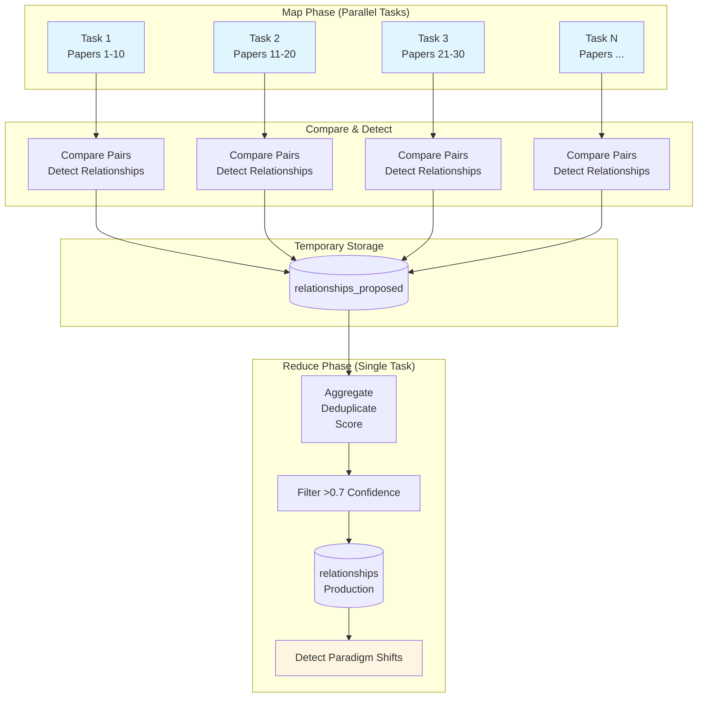

**Map Task** (Cloud Run Job with `--tasks=N`):
```python
def map_compare_papers(paper_batch, task_id):
    relationships = []

    for (paper_a, paper_b) in paper_pairs:
        for rel_type in ["supports", "contradicts", "extends"]:
            confidence = score_relationship(paper_a, paper_b, rel_type)

            if confidence > 0.6:
                relationships.append({
                    'source': paper_a.id,
                    'target': paper_b.id,
                    'type': rel_type,
                    'confidence': confidence,
                    'evidence': extract_evidence(paper_a, paper_b, rel_type)
                })

    # Write to temp collection
    firestore.collection('relationships_proposed').add_batch(relationships)
```

**Reduce Task**:
```python
def reduce_aggregate_relationships():
    proposed = firestore.collection('relationships_proposed').stream()

    # Group by (source, target) pair
    grouped = defaultdict(list)
    for rel in proposed:
        key = (rel['source'], rel['target'])
        grouped[key].append(rel)

    # Commit high-confidence relationships
    for (source, target), rels in grouped.items():
        best = max(rels, key=lambda r: r['confidence'])

        if best['confidence'] > 0.7:
            firestore.collection('relationships').add(best)

    # Clean up
    firestore.collection('relationships_proposed').delete_all()

    # Detect paradigm shifts
    detect_paradigm_shifts()
```

---

## Cloud Run Deployment Architecture

### Resource Types Summary

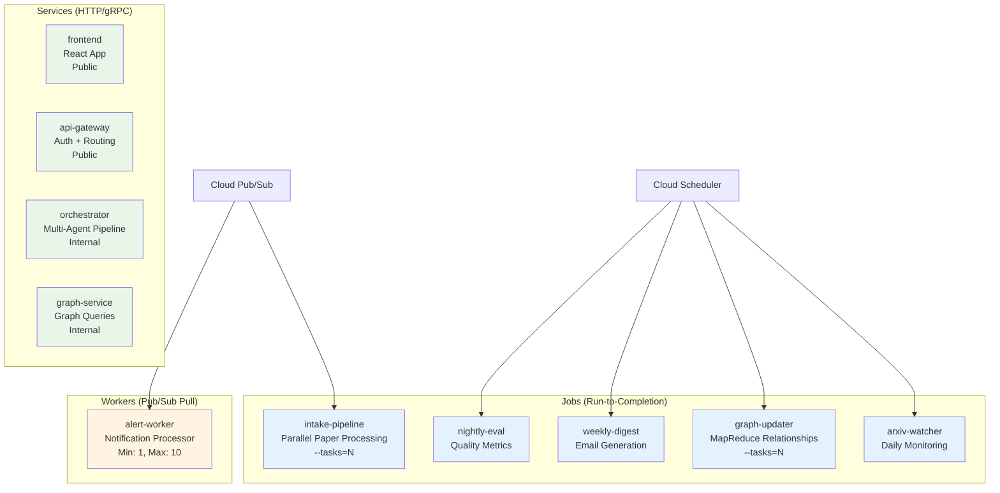

### Service Specifications

#### 1. Frontend Service
```yaml
Service: frontend
Type: Cloud Run Service
Image: gcr.io/PROJECT/frontend:latest
Port: 3000
Visibility: Public
Min Instances: 0
Max Instances: 10
CPU: 1
Memory: 512Mi
Timeout: 30s
Concurrency: 80
Environment:
  - API_GATEWAY_URL=https://api-gateway-xxxxx.run.app
  - WS_ENDPOINT=wss://alert-worker-xxxxx.run.app/ws
```

#### 2. API Gateway Service
```yaml
Service: api-gateway
Type: Cloud Run Service
Image: gcr.io/PROJECT/api-gateway:latest
Port: 8080
Visibility: Public
Min Instances: 1  # Keep warm
Max Instances: 50
CPU: 1
Memory: 512Mi
Timeout: 30s
Concurrency: 80
Environment:
  - ORCHESTRATOR_URL=https://orchestrator-xxxxx.run.app
  - GRAPH_SERVICE_URL=https://graph-service-xxxxx.run.app
Features:
  - Authentication (Firebase Auth)
  - Rate Limiting (100 req/min per user)
  - Request Logging
Routes:
  - POST /ask → orchestrator
  - POST /upload → intake job trigger
  - GET /graph → graph-service
  - GET /watch-rules → firestore
  - POST /watch-rules → firestore
```

#### 3. Orchestrator Service
```yaml
Service: orchestrator
Type: Cloud Run Service
Image: gcr.io/PROJECT/orchestrator:latest
Port: 8080
Visibility: Internal (VPC only)
Min Instances: 0
Max Instances: 20
CPU: 2
Memory: 2Gi
Timeout: 600s  # 10 minutes for complex queries
Concurrency: 8
Environment:
  - GEMINI_API_KEY=secret:gemini-key
  - FIRESTORE_PROJECT=PROJECT_ID
  - GRAPH_SERVICE_URL=https://graph-service-xxxxx.run.app
ADK Agents:
  - RouterAgent
  - RetrieverAgent
  - ContradictionAgent
  - ConfidenceAgent
  - SynthesisAgent
```

#### 4. Graph Service
```yaml
Service: graph-service
Type: Cloud Run Service
Image: gcr.io/PROJECT/graph-service:latest
Port: 8080
Visibility: Internal
Min Instances: 1  # Keep warm for fast queries
Max Instances: 10
CPU: 1
Memory: 1Gi
Timeout: 60s
Concurrency: 50
ADK Agent:
  - GraphQueryAgent (specialized)
Endpoints:
  - POST /lookup → graph_lookup_papers
  - POST /relationships → graph_find_relationships
  - POST /traverse → graph_traverse
  - POST /cluster → graph_get_cluster
```

### Job Specifications

#### 5. arXiv Watcher Job
```yaml
Job: arxiv-watcher
Type: Cloud Run Job
Image: gcr.io/PROJECT/arxiv-watcher:latest
Schedule: "0 6 * * *"  # Daily at 6am
Trigger: Cloud Scheduler
Task Count: 1
CPU: 1
Memory: 1Gi
Timeout: 15m
Max Retries: 2
Logic:
  1. Fetch papers from arXiv API (last 24 hours)
  2. Load active watch rules from Firestore
  3. Match papers against rules (keyword + semantic)
  4. Publish matches to Pub/Sub: arxiv.candidates
```

#### 6. Intake Pipeline Job
```yaml
Job: intake-pipeline
Type: Cloud Run Job (Parallelizable)
Image: gcr.io/PROJECT/intake-pipeline:latest
Trigger: Pub/Sub (arxiv.candidates)
Task Count: --tasks=N (one per paper)
CPU: 2
Memory: 2Gi
Timeout: 15m
Max Retries: 1
ADK Pipeline:
  - IngestorAgent: Download PDF
  - TableExtractorAgent: Extract tables (Gemini Vision)
  - EntityAgent: Extract methods, findings, datasets
  - RelationshipAgent: Initial relationship detection
  - IndexerAgent: Store in Firestore + Vector DB
Environment:
  - CLOUD_RUN_TASK_INDEX (0 to N-1)
  - CLOUD_RUN_TASK_COUNT (N)
Output:
  - Pub/Sub: docs.ready
```

#### 7. Graph Updater Job
```yaml
Job: graph-updater
Type: Cloud Run Job (MapReduce)
Image: gcr.io/PROJECT/graph-updater:latest
Schedule: "0 20 * * *"  # Daily at 8pm
Trigger: Cloud Scheduler
Task Count: --tasks=10 (map phase)
CPU: 2
Memory: 2Gi
Timeout: 30m
Max Retries: 1
Map Phase (Tasks 0-9):
  - Shard papers by task_index
  - Compare all pairs in shard
  - Detect relationships (supports, contradicts, extends)
  - Write to relationships_proposed collection
Reduce Phase (Task 0 only):
  - Aggregate proposed relationships
  - Deduplicate and score
  - Commit confidence > 0.7 to relationships
  - Detect paradigm shifts (citation velocity)
  - Clean up temp collection
```

#### 8. Weekly Digest Job
```yaml
Job: weekly-digest
Type: Cloud Run Job
Image: gcr.io/PROJECT/weekly-digest:latest
Schedule: "0 8 * * 0"  # Sunday at 8am
Trigger: Cloud Scheduler
Task Count: 1
CPU: 1
Memory: 1Gi
Timeout: 30m
Logic:
  1. Get all users with active watch rules
  2. For each user:
     - Aggregate papers from last 7 days
     - Generate personalized summary (LLM)
     - Send email via SendGrid
```

#### 9. Nightly Eval Job
```yaml
Job: nightly-eval
Type: Cloud Run Job
Image: gcr.io/PROJECT/nightly-eval:latest
Schedule: "0 0 * * *"  # Daily at midnight
Trigger: Cloud Scheduler
Task Count: 1
CPU: 1
Memory: 1Gi
Timeout: 20m
Metrics:
  - Extraction F1 (entities vs ground truth)
  - Citation Coverage (% sentences with receipts)
  - Answer Quality (ROUGE vs expected)
  - Latency Percentiles (p50, p90, p99)
Output: BigQuery table for dashboards
```

### Worker Specifications

#### 10. Alert Worker
```yaml
Worker: alert-worker
Type: Cloud Run Service (Pub/Sub Pull)
Image: gcr.io/PROJECT/alert-worker:latest
Port: 8080
Visibility: Internal
Min Instances: 1
Max Instances: 10
CPU: 1
Memory: 512Mi
Subscription: arxiv.matches
Ack Deadline: 60s
Logic:
  1. Pull alert message from Pub/Sub
  2. Get user info from Firestore
  3. Send email via SendGrid (high priority)
  4. Push to WebSocket (if user online)
  5. Update alert status in Firestore
  6. Ack message
```

### Cloud Scheduler Configuration

```yaml
# arXiv Daily Watch
- name: arxiv-watch-daily
  schedule: "0 6 * * *"
  timezone: America/New_York
  target: Cloud Run Job
  job: arxiv-watcher

# Graph Update Nightly
- name: graph-update-nightly
  schedule: "0 20 * * *"
  timezone: America/New_York
  target: Cloud Run Job
  job: graph-updater

# Weekly Digest
- name: weekly-digest
  schedule: "0 8 * * 0"
  timezone: America/New_York
  target: Cloud Run Job
  job: weekly-digest

# Nightly Evaluation
- name: nightly-eval
  schedule: "0 0 * * *"
  timezone: America/New_York
  target: Cloud Run Job
  job: nightly-eval
```

### Pub/Sub Topics & Subscriptions

```yaml
Topics:
  - arxiv.candidates
    Description: New papers matched to watch rules
    Publishers: arxiv-watcher job
    Subscribers: intake-pipeline job

  - docs.ready
    Description: Papers processed and indexed
    Publishers: intake-pipeline job
    Subscribers: (future) re-answer job

  - arxiv.matches
    Description: Alert queue for notifications
    Publishers: arxiv-watcher job
    Subscribers: alert-worker
    Ack Deadline: 60s
    Retention: 7 days
```

---

## API Specifications

### Public API Endpoints (API Gateway)

#### POST /ask
**Purpose**: Answer a research question

**Request**:
```json
{
  "question": "What is the effect of Drug X on HbA1c at 12 weeks?",
  "context": {
    "include_contradictions": true,
    "min_confidence": 0.5
  }
}
```

**Response**:
```json
{
  "answer": "Drug X reduced HbA1c by 0.5% at 12 weeks [Paper A, Table 2]...",
  "confidence_score": 0.75,
  "sources": [
    {
      "paper_id": "arxiv:2310.12345",
      "title": "...",
      "excerpt": "...",
      "relevance": 0.92
    }
  ],
  "contradictions": [
    {
      "paper_id": "arxiv:2309.11111",
      "claim": "Only 0.2% reduction observed",
      "reason": "Different dosage"
    }
  ],
  "metadata": {
    "latency_ms": 2340,
    "agents_used": ["RetrieverAgent", "GraphQueryAgent", "ConfidenceAgent", "SynthesisAgent"],
    "papers_searched": 47
  }
}
```

#### POST /upload
**Purpose**: Ingest a new paper

**Request**:
```json
{
  "source": "arxiv",
  "identifier": "2310.12345"
}
```
OR
```json
{
  "source": "file",
  "file_url": "gs://bucket/paper.pdf"
}
```

**Response**:
```json
{
  "status": "processing",
  "job_id": "intake-job-abc123",
  "estimated_completion": "2023-10-15T14:35:00Z"
}
```

#### GET /graph
**Purpose**: Get knowledge graph data for visualization

**Query Params**:
- `filter`: relationship type (optional)
- `limit`: max nodes (default 50)

**Response**:
```json
{
  "nodes": [
    {
      "id": "arxiv:2310.12345",
      "label": "Diffusion Models for...",
      "group": "recent",
      "value": 12,
      "meta": {
        "title": "...",
        "authors": ["Smith, J."],
        "year": 2023
      }
    }
  ],
  "edges": [
    {
      "id": "rel_001",
      "from": "arxiv:2310.12345",
      "to": "arxiv:2309.11111",
      "label": "contradicts",
      "color": {"color": "#ff4444"},
      "width": 3,
      "title": "Evidence: ..."
    }
  ]
}
```

#### GET /watch-rules
**Purpose**: Get user's watch rules

**Response**:
```json
{
  "rules": [
    {
      "rule_id": "user123_rule001",
      "name": "Sim-to-Real Transfer Research",
      "keywords": ["sim-to-real", "domain randomization"],
      "frequency": "daily",
      "active": true,
      "match_count": 15
    }
  ]
}
```

#### POST /watch-rules
**Purpose**: Create a new watch rule

**Request**:
```json
{
  "name": "Diffusion Models in Robotics",
  "keywords": ["diffusion models", "robotics", "manipulation"],
  "authors": ["Smith, J."],
  "topics": ["cs.RO", "cs.LG"],
  "frequency": "daily",
  "notification_method": "email"
}
```

**Response**:
```json
{
  "rule_id": "user123_rule002",
  "status": "active",
  "created_at": "2023-10-15T14:30:00Z"
}
```

### Internal API Endpoints

#### Orchestrator Service

**POST /process**
```json
{
  "pipeline": "qa",
  "input": {
    "question": "...",
    "user_id": "user123"
  }
}
```

#### Graph Service

**POST /lookup**
```json
{
  "entity": "diffusion_models",
  "entity_type": "method"
}
```

**Response**:
```json
{
  "papers": [
    {
      "paper_id": "arxiv:2310.12345",
      "relevance": 0.95
    }
  ]
}
```

**POST /relationships**
```json
{
  "paper_id": "arxiv:2310.12345",
  "relationship_type": "contradicts"
}
```

---

## Security & Scalability

### Authentication & Authorization

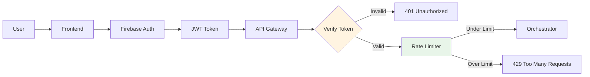

**Implementation**:
```python
# API Gateway
from firebase_admin import auth

@app.before_request
def authenticate():
    token = request.headers.get('Authorization', '').replace('Bearer ', '')

    try:
        decoded = auth.verify_id_token(token)
        request.user_id = decoded['uid']
    except:
        return jsonify({'error': 'Unauthorized'}), 401

@app.before_request
def rate_limit():
    user_id = request.user_id
    key = f"rate_limit:{user_id}"

    count = redis.incr(key)
    if count == 1:
        redis.expire(key, 60)  # 1 minute window

    if count > 100:  # 100 requests per minute
        return jsonify({'error': 'Rate limit exceeded'}), 429
```

### Scaling Strategy

**Auto-scaling Configuration**:
```yaml
Services:
  frontend:
    min: 0
    max: 10
    target_cpu: 70%

  api-gateway:
    min: 1  # Always warm
    max: 50
    target_cpu: 80%

  orchestrator:
    min: 0
    max: 20
    target_cpu: 70%
    target_concurrency: 8

  graph-service:
    min: 1  # Frequently accessed
    max: 10
    target_cpu: 60%

Jobs:
  intake-pipeline:
    tasks: dynamic  # One per paper
    max_parallel: 50

  graph-updater:
    tasks: 10  # Map phase
    max_parallel: 10

Worker:
  alert-worker:
    min: 1
    max: 10
    scale_up_on: queue_length > 100
```

### Cost Optimization

**Estimated Costs** (Idle state):

| Resource | Config | Idle Cost/Day | Active Cost/Day |
|----------|--------|---------------|-----------------|
| Frontend | min=0 | $0.00 | $0.10 |
| API Gateway | min=1 | $0.15 | $0.50 |
| Orchestrator | min=0 | $0.00 | $2.00 |
| Graph Service | min=1 | $0.15 | $0.30 |
| Alert Worker | min=1 | $0.12 | $0.25 |
| arXiv Watcher | 1x/day | $0.05 | - |
| Intake Jobs | Variable | $0.00 | $1.50 |
| Graph Updater | 1x/day | $0.10 | - |
| **Total** | | **$0.57/day** | **~$5/day** |

**Optimization Strategies**:
1. Scale to zero for low-traffic services
2. Use Cloud Scheduler for batch jobs (not always-on)
3. Implement request caching in API Gateway
4. Use Firestore query caching
5. Batch Pub/Sub messages

### Data Security

**Sensitive Data Protection**:
```yaml
API Keys:
  - Store in Secret Manager
  - Rotate every 90 days
  - Access via IAM roles only

Firestore:
  - Enable encryption at rest (default)
  - Use security rules:
    ```
    rules_version = '2';
    service cloud.firestore {
      match /databases/{database}/documents {
        match /papers/{paperId} {
          allow read: if request.auth != null;
          allow write: if false;  // Only jobs can write
        }
        match /watch_rules/{ruleId} {
          allow read, write: if request.auth.uid == resource.data.user_id;
        }
      }
    }
    ```

Cloud Storage:
  - Uniform bucket-level access
  - IAM roles (no public access)
  - Signed URLs for temporary access

Network:
  - VPC for internal services
  - Cloud Armor for DDoS protection
  - TLS 1.3 only
```

---

## Technology Stack

### Core Technologies

| Component | Technology | Version | Purpose |
|-----------|-----------|---------|---------|
| **Agent Framework** | Google ADK | Latest | Multi-agent orchestration |
| **LLM** | Gemini 2.0 Flash Exp | Latest | Agent reasoning |
| **Database** | Firestore | Native | Document store, knowledge graph |
| **Vector DB** | Vertex AI Vector Search | Latest | Semantic search |
| **Storage** | Cloud Storage | Latest | PDF storage |
| **Analytics** | BigQuery | Latest | Metrics & trends |
| **Message Queue** | Cloud Pub/Sub | Latest | Asynchronous processing |
| **Scheduler** | Cloud Scheduler | Latest | Cron jobs |
| **Compute** | Cloud Run | Latest | Services, Jobs, Workers |
| **Frontend** | React | 18.x | Dashboard UI |
| **Visualization** | vis.js | 9.x | Knowledge graph |
| **Email** | SendGrid | API v3 | Notifications |

### Python Dependencies

```txt
# Core
google-adk==0.1.0
google-generativeai==0.3.0
google-cloud-firestore==2.14.0
google-cloud-storage==2.14.0
google-cloud-pubsub==2.19.0
google-cloud-aiplatform==1.38.0

# PDF Processing
PyMuPDF==1.23.8
pdfplumber==0.10.3

# ML/NLP
sentence-transformers==2.2.2
faiss-cpu==1.7.4
numpy==1.24.3

# Web Framework
flask==3.0.0
flask-cors==4.0.0
gunicorn==21.2.0

# Utilities
python-dotenv==1.0.0
requests==2.31.0
```

### Frontend Dependencies

```json
{
  "dependencies": {
    "react": "^18.2.0",
    "react-dom": "^18.2.0",
    "vis-network": "^9.1.6",
    "axios": "^1.6.0",
    "react-query": "^3.39.3",
    "tailwindcss": "^3.3.5"
  }
}
```

---

## Deployment Commands Reference

### Initial Setup

```bash
# Set project
gcloud config set project PROJECT_ID

# Enable APIs
gcloud services enable run.googleapis.com \
  cloudbuild.googleapis.com \
  firestore.googleapis.com \
  pubsub.googleapis.com \
  cloudscheduler.googleapis.com

# Create Firestore database
gcloud firestore databases create --region=us-central1

# Create Pub/Sub topics
gcloud pubsub topics create arxiv.candidates
gcloud pubsub topics create docs.ready
gcloud pubsub topics create arxiv.matches

# Create subscriptions
gcloud pubsub subscriptions create alert-subscription \
  --topic=arxiv.matches \
  --ack-deadline=60
```

### Deploy Services

```bash
# Frontend
gcloud run deploy frontend \
  --source ./frontend \
  --region us-central1 \
  --allow-unauthenticated \
  --min-instances 0 \
  --max-instances 10

# API Gateway
gcloud run deploy api-gateway \
  --source ./api-gateway \
  --region us-central1 \
  --allow-unauthenticated \
  --min-instances 1 \
  --max-instances 50

# Orchestrator
gcloud run deploy orchestrator \
  --source ./orchestrator \
  --region us-central1 \
  --no-allow-unauthenticated \
  --min-instances 0 \
  --max-instances 20 \
  --memory 2Gi \
  --timeout 600

# Graph Service
gcloud run deploy graph-service \
  --source ./graph-service \
  --region us-central1 \
  --no-allow-unauthenticated \
  --min-instances 1 \
  --max-instances 10
```

### Deploy Jobs

```bash
# arXiv Watcher
gcloud run jobs create arxiv-watcher \
  --source ./jobs/arxiv-watcher \
  --region us-central1 \
  --task-timeout 15m

# Intake Pipeline
gcloud run jobs create intake-pipeline \
  --source ./jobs/intake-pipeline \
  --region us-central1 \
  --task-timeout 15m \
  --tasks 1 \
  --parallelism 10

# Graph Updater
gcloud run jobs create graph-updater \
  --source ./jobs/graph-updater \
  --region us-central1 \
  --task-timeout 30m \
  --tasks 10 \
  --parallelism 10
```

### Deploy Worker

```bash
gcloud run deploy alert-worker \
  --source ./workers/alert-worker \
  --region us-central1 \
  --no-allow-unauthenticated \
  --min-instances 1 \
  --max-instances 10
```

### Setup Schedulers

```bash
# arXiv Daily Watch
gcloud scheduler jobs create http arxiv-watch-daily \
  --location us-central1 \
  --schedule "0 6 * * *" \
  --uri "https://run.googleapis.com/v1/projects/PROJECT_ID/locations/us-central1/jobs/arxiv-watcher:run" \
  --http-method POST \
  --oauth-service-account-email SERVICE_ACCOUNT@PROJECT_ID.iam.gserviceaccount.com

# Graph Update Nightly
gcloud scheduler jobs create http graph-update-nightly \
  --location us-central1 \
  --schedule "0 20 * * *" \
  --uri "https://run.googleapis.com/v1/projects/PROJECT_ID/locations/us-central1/jobs/graph-updater:run" \
  --http-method POST \
  --oauth-service-account-email SERVICE_ACCOUNT@PROJECT_ID.iam.gserviceaccount.com
```

---

## Monitoring & Observability

### Key Metrics to Track

```yaml
Latency Metrics:
  - API Gateway p50, p90, p99
  - Orchestrator processing time
  - Per-agent execution time

Throughput Metrics:
  - Questions answered per hour
  - Papers ingested per day
  - Alerts sent per day

Quality Metrics:
  - Average confidence score
  - Citation coverage (% sentences with receipts)
  - User satisfaction (if available)

Cost Metrics:
  - Gemini API calls per day
  - Cloud Run cost per day
  - Storage cost per month

Error Metrics:
  - Failed ingestion jobs
  - Agent timeouts
  - API error rate (4xx, 5xx)
```

### Logging Strategy

```python
# Structured logging
import logging
import json

logger = logging.getLogger(__name__)

def log_agent_execution(agent_name, input_data, output_data, duration_ms):
    logger.info(json.dumps({
        "event": "agent_execution",
        "agent": agent_name,
        "duration_ms": duration_ms,
        "input_size": len(str(input_data)),
        "output_size": len(str(output_data)),
        "timestamp": datetime.utcnow().isoformat()
    }))
```

---

## Summary

This architecture provides:

✅ **Scalability**: Auto-scales from 0 to 100+ concurrent requests
✅ **Cost Efficiency**: ~$0.57/day idle, ~$5/day active
✅ **Reliability**: Retries, error handling, graceful degradation
✅ **Trust**: Confidence scoring, contradiction detection, citation verification
✅ **Intelligence**: 7 specialized agents orchestrated by Google ADK
✅ **Hackathon Requirements**: All 3 Cloud Run types, multi-agent, deployed

**Next Steps**: Proceed to implementation following the day-by-day plan in the complete blueprint document.
