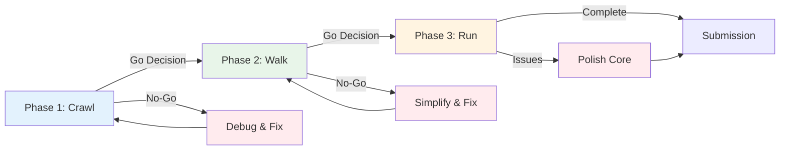

# Research Intelligence Platform - Implementation Plan

**Phased Development: Crawl → Walk → Run**
**Last Updated**: 2025-10-27

---

## Table of Contents

1. [Overview](#overview)
2. [Phase 1: Crawl (Days 0-1)](#phase-1-crawl-days-0-1)
3. [Phase 2: Walk (Days 2-3)](#phase-2-walk-days-2-3)
4. [Phase 3: Run (Day 4)](#phase-3-run-day-4)
5. [Risk Mitigation](#risk-mitigation)
6. [Decision Framework](#decision-framework)

---

## Overview

### Philosophy

Each phase follows **evidence-based progression**:
1. Define clear, measurable goals
2. Implement and test
3. Measure against objective criteria
4. Go/No-Go decision with data
5. Document learnings before proceeding

### Success Metrics Hierarchy

```
Level 1 (Blocker): Must pass to proceed
Level 2 (Critical): Should pass, but can proceed with mitigation plan
Level 3 (Nice-to-have): Defer to next phase if time-constrained
```

### Phase Transitions



---

## Phase 1: CRAWL (Days 0-1)

**Goal**: Prove the concept end-to-end with minimal but working system

**Motto**: "Make it work, not pretty"

### Pre-Phase: Setup (Evening Before, 2-3 hours)

#### Sub-Phase 0.1: Environment Setup

**Objective**: Get development environment ready

**Tasks**:
- [ ] Install `google-adk` and `google-generativeai`
- [ ] Create GCP project and enable APIs
- [ ] Setup Firestore database
- [ ] Get Gemini API key from AI Studio
- [ ] Clone project structure
- [ ] Setup `.env` file

**Done-When Criteria**:

| Criterion | Level | Test Method | Pass Threshold |
|-----------|-------|-------------|----------------|
| ADK imports successfully | 1 | `python -c "from google.adk import LlmAgent"` | No errors |
| Gemini API works | 1 | Test script calls Gemini | Returns response |
| Firestore connection works | 1 | Write/read test document | Success |
| Project structure exists | 1 | `ls src/agents src/tools` | Directories exist |

**Go/No-Go Decision**:
```python
def phase_0_go_decision():
    checks = {
        'adk_installed': test_adk_import(),
        'gemini_api': test_gemini_call(),
        'firestore': test_firestore_connection(),
        'structure': test_directory_structure()
    }

    blockers = [k for k, v in checks.items() if not v]

    if blockers:
        print(f"❌ BLOCKERS: {blockers}")
        print("Action: Fix issues before proceeding")
        return False

    print("✅ Setup complete, proceeding to Phase 1.1")
    return True
```

**Time Budget**: 2-3 hours (hard cap)
**Fallback**: If >3 hours, use mock Firestore and proceed

---

### Sub-Phase 1.1: Basic PDF Ingestion (Morning, 4 hours)

**Objective**: Load PDF → Extract text → Store in Firestore

**Tasks**:
1. Implement `pdf_reader.py` tool
2. Create `IngestorAgent` (basic)
3. Create `EntityAgent` (extract 3 fields: title, authors, key finding)
4. Create `IndexerAgent` (store in Firestore)
5. Build `ingestion_pipeline.py` (SequentialAgent)
6. Test on 3 real papers

**Code Skeleton**:
```python
# src/tools/pdf_reader.py
def read_pdf(file_path: str) -> dict:
    """Extract text from PDF"""
    # Uses PyMuPDF
    pass

# src/agents/ingestion/entity_agent.py
class EntityAgent(BaseResearchAgent):
    def _create_agent(self):
        return self.create_agent(
            instruction="""
            Extract from this paper:
            1. Title
            2. Authors (first 3)
            3. One key finding (1 sentence)

            Return JSON: {"title": "...", "authors": [...], "finding": "..."}
            """,
            tools=[],  # Pure LLM, no tools needed
            output_key="entities"
        )

# src/pipelines/ingestion_pipeline.py
from google.adk.agents import SequentialAgent

ingestion_pipeline = SequentialAgent(
    name="IngestionPipeline",
    sub_agents=[
        load_agent,    # Custom agent that loads PDF
        entity_agent,  # Extract entities
        indexer_agent  # Store in Firestore
    ]
)
```

**Done-When Criteria**:

| Criterion | Level | Test Method | Pass Threshold |
|-----------|-------|-------------|----------------|
| Can extract text from PDF | 1 | Test on 3 different PDFs | ≥2/3 succeed |
| EntityAgent extracts title | 1 | Manual inspection | Title is correct |
| EntityAgent extracts authors | 2 | Manual inspection | At least 1 author correct |
| Data stored in Firestore | 1 | Query Firestore | Document exists |
| Pipeline runs end-to-end | 1 | `python test_ingestion.py` | No crashes |
| Processing time < 2 min/paper | 2 | Time measurement | Avg < 120s |

**Success Metrics**:
```python
def test_ingestion_pipeline():
    test_papers = [
        "tests/fixtures/paper1.pdf",
        "tests/fixtures/paper2.pdf",
        "tests/fixtures/paper3.pdf"
    ]

    results = []
    for paper in test_papers:
        start = time.time()
        try:
            result = ingestion_pipeline.run({"pdf_path": paper})
            duration = time.time() - start

            # Check if stored in Firestore
            paper_id = result.get('paper_id')
            stored = firestore_client.get_paper(paper_id) is not None

            results.append({
                'success': stored,
                'duration': duration,
                'paper': paper
            })
        except Exception as e:
            results.append({
                'success': False,
                'error': str(e),
                'paper': paper
            })

    success_rate = sum(r['success'] for r in results) / len(results)
    avg_duration = np.mean([r['duration'] for r in results if 'duration' in r])

    return {
        'success_rate': success_rate,
        'avg_duration': avg_duration,
        'details': results
    }
```

**Go/No-Go Decision**:
```python
def phase_1_1_go_decision(metrics):
    # Level 1 (Blockers)
    if metrics['success_rate'] < 0.66:  # At least 2/3 must work
        return False, "Ingestion success rate too low"

    # Level 2 (Critical, but can proceed)
    if metrics['avg_duration'] > 180:  # 3 minutes
        print("⚠️  WARNING: Ingestion is slow, but proceeding")

    return True, "Ingestion pipeline working"
```

**Time Budget**: 4 hours
**Fallback**: If extraction fails, use simpler approach (just store PDF text, skip entities)

---

### Sub-Phase 1.2: Simple Q&A (Afternoon, 4 hours)

**Objective**: Ask question → Get answer with citation

**Tasks**:
1. Implement `retrieval.py` tool (keyword search only)
2. Create `RetrieverAgent`
3. Create `AnswerAgent`
4. Build `qa_pipeline.py` (SequentialAgent)
5. Test on 5 questions

**Code Skeleton**:
```python
# src/tools/retrieval.py
def keyword_search(query: str, limit: int = 5) -> list:
    """Simple keyword search in Firestore"""
    papers = firestore_client.query_papers(...)
    # Score by keyword overlap
    return top_papers

# src/agents/retriever_agent.py
class RetrieverAgent(BaseResearchAgent):
    def _create_agent(self):
        return self.create_agent(
            instruction="Call keyword_search(question) to find relevant papers",
            tools=[keyword_search],
            output_key="retrieved_papers"
        )

# src/agents/answer_agent.py
class AnswerAgent(BaseResearchAgent):
    def _create_agent(self):
        return self.create_agent(
            instruction="""
            Answer the question using the retrieved papers.
            Include a citation: [Paper Title]
            If no relevant info, say "I don't have enough information"
            """,
            tools=[],
            output_key="answer"
        )

# src/pipelines/qa_pipeline.py
qa_pipeline = SequentialAgent(
    name="QAPipeline",
    sub_agents=[retriever_agent, answer_agent]
)
```

**Done-When Criteria**:

| Criterion | Level | Test Method | Pass Threshold |
|-----------|-------|-------------|----------------|
| Retriever finds relevant papers | 1 | Test on 5 questions | ≥3/5 relevant |
| Answer includes citation | 1 | Manual inspection | Has [Paper X] format |
| Answer is factually correct | 2 | Manual verification | ≥3/5 correct |
| Answer says "not enough info" when appropriate | 2 | Test with out-of-scope question | Correctly refuses |
| Latency < 10 seconds | 2 | Time measurement | p90 < 10s |

**Test Questions**:
```python
TEST_QUESTIONS = [
    {
        "question": "Who are the authors of the paper on diffusion models?",
        "expected_contains": ["author names from ingested papers"],
        "paper_should_match": "arxiv:2310.12345"
    },
    {
        "question": "What was the key finding about sim-to-real transfer?",
        "expected_contains": ["finding text"],
        "paper_should_match": "arxiv:2310.12345"
    },
    {
        "question": "What is the capital of France?",  # Out of scope
        "expected_answer": "I don't have enough information"
    }
]

def test_qa_pipeline():
    results = []
    for test in TEST_QUESTIONS:
        start = time.time()
        result = qa_pipeline.run({"question": test['question']})
        duration = time.time() - start

        answer = result.get('answer', '')
        has_citation = '[' in answer and ']' in answer

        results.append({
            'question': test['question'],
            'answer': answer,
            'has_citation': has_citation,
            'duration': duration,
            'passes': evaluate_answer(answer, test)
        })

    return results
```

**Go/No-Go Decision**:
```python
def phase_1_2_go_decision(results):
    pass_rate = sum(r['passes'] for r in results) / len(results)
    citation_rate = sum(r['has_citation'] for r in results) / len(results)
    p90_latency = np.percentile([r['duration'] for r in results], 90)

    blockers = []
    if pass_rate < 0.6:
        blockers.append("Answer quality too low")
    if citation_rate < 0.8:
        blockers.append("Missing citations")

    if blockers:
        return False, blockers

    if p90_latency > 10:
        print("⚠️  WARNING: High latency, but proceeding")

    return True, "Q&A pipeline working"
```

**Time Budget**: 4 hours
**Fallback**: Simplify answer agent to just return paper snippet (no synthesis)

---

### Phase 1 Completion Checklist

**Evidence Required**:
- [ ] 3 papers successfully ingested and in Firestore
- [ ] Screenshot of Firestore console showing paper documents
- [ ] 5 test questions with answers and citations
- [ ] Latency measurements recorded
- [ ] Git commit: `feat: Phase 1 Crawl complete - basic ingestion and Q&A`
- [ ] Tag: `v0.1.0-crawl`

**Demo Readiness**:
- [ ] Can upload paper (via script)
- [ ] Can ask question (via script or simple UI)
- [ ] Can show answer with citation
- [ ] Total demo time: < 2 minutes

**Phase 1 Go/No-Go Decision**:

```python
def phase_1_complete_decision():
    checks = {
        'ingestion_works': ingestion_success_rate >= 0.66,
        'qa_works': qa_pass_rate >= 0.6,
        'citations_present': citation_rate >= 0.8,
        'data_in_firestore': count_papers_in_firestore() >= 3
    }

    # Level 1 blockers
    blockers = [k for k, v in checks.items() if not v]

    if blockers:
        print(f"❌ PHASE 1 BLOCKED: {blockers}")
        print("Action: Fix blockers before Phase 2")
        return False

    print("✅ PHASE 1 COMPLETE")
    print("Proceeding to Phase 2: Walk")
    return True
```

**Time Checkpoint**: End of Day 1
- If ahead: Start Phase 2.1
- If on track: Commit and document
- If behind: Assess if Phase 2 can be simplified

---

## Phase 2: WALK (Days 2-3)

**Goal**: Add intelligence, trust mechanisms, and proactive features

**Motto**: "Make it smart and trustworthy"

### Sub-Phase 2.1: Knowledge Graph Foundation (Day 2 Morning, 4 hours)

**Objective**: Detect relationships between papers

**Tasks**:
1. Implement `relationship_agent.py`
2. Implement `graph_operations.py` tools
3. Modify ingestion pipeline to detect relationships
4. Store relationships in Firestore
5. Test relationship detection on 3 paper pairs

**Code Skeleton**:
```python
# src/agents/ingestion/relationship_agent.py
class RelationshipAgent(BaseResearchAgent):
    def _create_agent(self):
        return self.create_agent(
            instruction="""
            Compare this paper to existing papers in the corpus.
            Detect relationships:
            - supports: Similar findings
            - contradicts: Conflicting findings
            - extends: Builds upon
            - cites: References

            Return JSON array of relationships.
            """,
            tools=[compare_papers, get_existing_papers],
            output_key="relationships"
        )

# src/tools/graph_operations.py
def detect_relationship(paper_a: dict, paper_b: dict) -> dict:
    """Use LLM to compare papers and detect relationship"""
    prompt = f"""
    Paper A findings: {paper_a['entities']['findings']}
    Paper B findings: {paper_b['entities']['findings']}

    Relationship? (supports/contradicts/none)
    Confidence: 0.0-1.0
    Evidence: brief explanation
    """
    # Call Gemini
    return {'type': 'supports', 'confidence': 0.85, 'evidence': '...'}
```

**Done-When Criteria**:

| Criterion | Level | Test Method | Pass Threshold |
|-----------|-------|-------------|----------------|
| Can detect "supports" relationship | 1 | Test on 2 similar papers | Confidence > 0.6 |
| Can detect "contradicts" relationship | 1 | Test on 2 conflicting papers | Confidence > 0.6 |
| Relationships stored in Firestore | 1 | Query relationships collection | ≥1 relationship exists |
| False positive rate | 2 | Test on unrelated papers | <30% incorrect |
| Processing time | 2 | Time per pair | <30s |

**Test Cases**:
```python
TEST_PAIRS = [
    {
        "type": "supports",
        "paper_a": "Paper claiming 15% improvement",
        "paper_b": "Paper claiming 18% improvement (same method)",
        "expected": "supports"
    },
    {
        "type": "contradicts",
        "paper_a": "Paper claiming method works",
        "paper_b": "Paper claiming null results for same method",
        "expected": "contradicts"
    },
    {
        "type": "unrelated",
        "paper_a": "Paper on robotics",
        "paper_b": "Paper on NLP",
        "expected": "none"
    }
]

def test_relationship_detection():
    results = []
    for test in TEST_PAIRS:
        detected = detect_relationship(test['paper_a'], test['paper_b'])
        correct = detected['type'] == test['expected']
        results.append({
            'test': test['type'],
            'detected': detected['type'],
            'expected': test['expected'],
            'correct': correct,
            'confidence': detected['confidence']
        })

    accuracy = sum(r['correct'] for r in results) / len(results)
    return {'accuracy': accuracy, 'details': results}
```

**Go/No-Go Decision**:
```python
def phase_2_1_go_decision(metrics):
    accuracy = metrics['accuracy']

    if accuracy < 0.5:
        return False, "Relationship detection accuracy too low"

    if accuracy < 0.7:
        print("⚠️  WARNING: Moderate accuracy, may need tuning later")

    return True, "Relationship detection working"
```

**Time Budget**: 4 hours
**Fallback**: If accuracy poor, simplify to just "cites" (from bibliography parsing)

---

### Sub-Phase 2.2: Proactive Alerting (Day 2 Afternoon, 4 hours)

**Objective**: Watch rules + matching + alert delivery

**Tasks**:
1. Create watch_rules CRUD in Firestore
2. Implement matching logic in `arxiv_watcher` job
3. Create `alert_worker` (Pub/Sub consumer)
4. Setup SendGrid integration
5. Test with 1 watch rule and 1 matching paper

**Code Skeleton**:
```python
# src/jobs/arxiv_watcher/matcher.py
def match_paper_to_rules(paper: dict, rules: list) -> list:
    """Match paper against watch rules"""
    matches = []
    for rule in rules:
        score = calculate_match_score(paper, rule)
        if score > rule['min_relevance_score']:
            matches.append({
                'rule_id': rule['rule_id'],
                'paper_id': paper['paper_id'],
                'score': score
            })
    return matches

def calculate_match_score(paper: dict, rule: dict) -> float:
    """Simple keyword overlap score"""
    paper_text = f"{paper['title']} {paper['abstract']}".lower()
    matches = sum(1 for kw in rule['keywords'] if kw.lower() in paper_text)
    return matches / len(rule['keywords'])

# src/workers/alert_worker/main.py
from flask import Flask, request
from google.cloud import pubsub_v1

app = Flask(__name__)
subscriber = pubsub_v1.SubscriberClient()

def callback(message):
    alert_data = json.loads(message.data)
    process_alert(alert_data)
    message.ack()

subscription_path = subscriber.subscription_path(PROJECT, 'alert-subscription')
future = subscriber.subscribe(subscription_path, callback=callback)
```

**Done-When Criteria**:

| Criterion | Level | Test Method | Pass Threshold |
|-----------|-------|-------------|----------------|
| Can create watch rule | 1 | API call or Firestore | Rule stored |
| Matching logic works | 1 | Test paper matches rule | Score > 0.7 |
| Alert published to Pub/Sub | 1 | Check Pub/Sub console | Message exists |
| Email sent via SendGrid | 2 | Check inbox | Email received |
| Alert stored in Firestore | 1 | Query alerts collection | Alert exists |
| End-to-end latency | 3 | Time from match to email | <5 minutes |

**Test Scenario**:
```python
def test_proactive_alerting():
    # 1. Create watch rule
    rule = {
        'name': 'Test Rule',
        'keywords': ['diffusion models', 'robotics'],
        'user_id': 'test_user'
    }
    firestore_client.create_watch_rule(rule)

    # 2. Simulate new paper
    paper = {
        'title': 'Diffusion Models for Robotic Manipulation',
        'abstract': 'We present a novel approach...'
    }

    # 3. Run matcher
    matches = match_paper_to_rules(paper, [rule])
    assert len(matches) == 1
    assert matches[0]['score'] > 0.5

    # 4. Publish to Pub/Sub
    publish_alert(matches[0])

    # 5. Wait for worker to process
    time.sleep(10)

    # 6. Check alert created
    alerts = firestore_client.get_alerts(user_id='test_user')
    assert len(alerts) >= 1

    return {'success': True}
```

**Go/No-Go Decision**:
```python
def phase_2_2_go_decision(test_result):
    if not test_result['success']:
        return False, "Alerting flow broken"

    # Email is Level 2 - can proceed without it
    if not email_received:
        print("⚠️  WARNING: Email not sent, but flow works")

    return True, "Proactive alerting working"
```

**Time Budget**: 4 hours
**Fallback**: Skip email, just store alerts in Firestore (Level 2)

---

### Sub-Phase 2.3: Multi-Agent Intelligence (Day 3 Morning, 4 hours)

**Objective**: Parallel evidence gathering + confidence scoring

**Tasks**:
1. Create `GraphQueryAgent`
2. Create `ContradictionAgent`
3. Create `ConfidenceAgent`
4. Refactor `qa_pipeline` to use ParallelAgent
5. Test on 3 questions

**Code Skeleton**:
```python
# src/pipelines/qa_pipeline.py (v2)
from google.adk.agents import ParallelAgent

evidence_gathering = ParallelAgent(
    name="EvidenceGathering",
    sub_agents=[
        retriever_agent,
        graph_query_agent,
        contradiction_agent
    ]
)

qa_pipeline_v2 = SequentialAgent(
    name="QAPipeline",
    sub_agents=[
        evidence_gathering,  # Parallel
        confidence_agent,
        synthesis_agent
    ]
)
```

**Done-When Criteria**:

| Criterion | Level | Test Method | Pass Threshold |
|-----------|-------|-------------|----------------|
| GraphQueryAgent returns related papers | 2 | Test query | ≥1 related paper |
| ContradictionAgent finds contradictions | 2 | Test on known conflict | Finds conflict |
| ConfidenceAgent returns score 0-1 | 1 | Test on any answer | Score in range |
| Confidence correlates with quality | 2 | Manual assessment | High score → good answer |
| Parallel execution faster than sequential | 3 | Time comparison | ≥20% faster |
| Answer includes confidence in output | 1 | Check response format | Has confidence field |

**Test Cases**:
```python
def test_multi_agent_intelligence():
    # Question where we have good evidence
    q1 = "What was the success rate in Paper A?"
    result1 = qa_pipeline_v2.run({"question": q1})
    assert result1['confidence_score'] > 0.7

    # Question where we have contradictions
    q2 = "Does method X work for deformable objects?"
    result2 = qa_pipeline_v2.run({"question": q2})
    assert len(result2['contradictions']) > 0
    assert result2['confidence_score'] < 0.7  # Lower due to contradictions

    # Question where we have no data
    q3 = "What is quantum entanglement?"
    result3 = qa_pipeline_v2.run({"question": q3})
    assert result3['confidence_score'] < 0.5
    assert "not enough information" in result3['answer'].lower()

    return {'tests_passed': 3}
```

**Go/No-Go Decision**:
```python
def phase_2_3_go_decision(test_results):
    # Confidence scoring is Level 1 - must work
    if test_results['tests_passed'] < 2:
        return False, "Multi-agent intelligence not working"

    return True, "Intelligence layer working"
```

**Time Budget**: 4 hours
**Fallback**: Skip GraphQueryAgent, just use retriever + confidence

---

### Sub-Phase 2.4: Trust Verification (Day 3 Afternoon, 3 hours)

**Objective**: Verify citations and add source evidence

**Tasks**:
1. Create `VerifierAgent`
2. Add citation verification to pipeline
3. Generate evidence JSON
4. Test on 3 answers

**Code Skeleton**:
```python
# src/agents/verifier_agent.py
class VerifierAgent(BaseResearchAgent):
    def _create_agent(self):
        return self.create_agent(
            instruction="""
            Given the answer and source papers, verify:
            1. Every claim has a citation
            2. Citations are correct (paper mentions the claim)
            3. No hallucinations

            Return: VALID or INVALID with explanation
            """,
            tools=[check_citation_in_paper],
            output_key="verification"
        )

# Extended pipeline
qa_pipeline_v3 = SequentialAgent(
    sub_agents=[
        evidence_gathering,
        confidence_agent,
        synthesis_agent,
        verifier_agent  # Added
    ]
)
```

**Done-When Criteria**:

| Criterion | Level | Test Method | Pass Threshold |
|-----------|-------|-------------|----------------|
| Detects missing citations | 1 | Test answer without citation | Flags as INVALID |
| Detects incorrect citations | 2 | Test with wrong paper ID | Flags as INVALID |
| Valid answers pass | 1 | Test good answer | Returns VALID |
| Verification latency | 3 | Time measurement | <5s |

**Go/No-Go Decision**:
```python
def phase_2_4_go_decision(test_results):
    if test_results['detects_missing'] and test_results['valid_pass']:
        return True, "Verification working"

    return False, "Verification broken"
```

**Time Budget**: 3 hours
**Fallback**: Skip verifier, rely on confidence scores only

---

### Phase 2 Completion Checklist

**Evidence Required**:
- [ ] At least 1 relationship detected and stored
- [ ] Watch rule created and alert triggered end-to-end
- [ ] Screenshot of alert email received
- [ ] 3 questions answered with confidence scores
- [ ] Confidence scores make intuitive sense (high for good data, low for gaps)
- [ ] All agents logged execution times
- [ ] Git commit: `feat: Phase 2 Walk complete - intelligence and trust`
- [ ] Tag: `v0.2.0-walk`

**Demo Readiness**:
- [ ] Can show proactive alert flow (email screenshot)
- [ ] Can show answer with confidence score
- [ ] Can show contradiction detection
- [ ] Total demo time: < 3 minutes

**Phase 2 Go/No-Go Decision**:

```python
def phase_2_complete_decision():
    checks = {
        'relationships_detected': count_relationships() >= 1,
        'alerts_working': test_alert_flow(),
        'confidence_working': test_confidence_scores(),
        'multi_agent_working': test_parallel_agents()
    }

    # Level 1 blockers
    level_1_pass = (
        checks['alerts_working'] and
        checks['confidence_working']
    )

    if not level_1_pass:
        print("❌ PHASE 2 BLOCKED")
        return False

    # Level 2 warnings
    if not checks['relationships_detected']:
        print("⚠️  No relationships detected, graph will be sparse")

    print("✅ PHASE 2 COMPLETE")
    print("Proceeding to Phase 3: Run")
    return True
```

**Time Checkpoint**: End of Day 3
- If ahead: Start Phase 3 early
- If on track: Polish demo
- If behind: Make Phase 3 Go/No-Go decision

---

## Phase 3: RUN (Day 4)

**Goal**: Production-ready polish and deployment

**Motto**: "Make it shine"

### Sub-Phase 3.1: Deployment (Morning, 3 hours)

**Objective**: All services deployed to Cloud Run

**Tasks**:
1. Write Dockerfiles for all services
2. Deploy api-gateway
3. Deploy orchestrator
4. Deploy graph-service (if built)
5. Deploy frontend
6. Deploy jobs (arxiv-watcher, intake-pipeline)
7. Deploy alert-worker
8. Setup Cloud Scheduler

**Deployment Checklist**:
```bash
# API Gateway
gcloud run deploy api-gateway --source ./src/services/api_gateway --region us-central1

# Orchestrator
gcloud run deploy orchestrator --source ./src/services/orchestrator --region us-central1

# Jobs
gcloud run jobs create arxiv-watcher --source ./src/jobs/arxiv_watcher --region us-central1

# Scheduler
gcloud scheduler jobs create http arxiv-watch-daily \
  --schedule "0 6 * * *" \
  --uri "https://run.googleapis.com/..." \
  --http-method POST
```

**Done-When Criteria**:

| Criterion | Level | Test Method | Pass Threshold |
|-----------|-------|-------------|----------------|
| All services deployed | 1 | `gcloud run services list` | Shows all services |
| Services are healthy | 1 | Hit /health endpoints | 200 OK |
| Can access public URL | 1 | Open frontend URL in browser | Loads |
| Jobs can be triggered | 1 | `gcloud run jobs execute` | Runs successfully |
| Scheduler configured | 2 | Check Cloud Scheduler | Jobs listed |
| Total Cloud Run deployments | 1 | Count | ≥6 (4 services + 2 jobs minimum) |

**Go/No-Go Decision**:
```python
def phase_3_1_go_decision():
    services = gcloud_list_services()
    jobs = gcloud_list_jobs()

    if len(services) < 3:
        return False, "Not enough services deployed"

    if not all_healthy(services):
        return False, "Services not healthy"

    if len(jobs) < 1:
        print("⚠️  WARNING: No jobs deployed, alerting won't work")

    return True, "Deployment complete"
```

**Time Budget**: 3 hours
**Fallback**: Deploy only api-gateway + orchestrator (minimum viable)

---

### Sub-Phase 3.2: Visualization (If Ahead, 3-4 hours)

**Objective**: Knowledge graph visualization

**Tasks**:
1. Create `/api/graph` endpoint
2. Build React component with vis.js
3. Test graph rendering
4. Add filters (relationship type)

**Done-When Criteria**:

| Criterion | Level | Test Method | Pass Threshold |
|-----------|-------|-------------|----------------|
| Graph API returns data | 3 | GET /api/graph | Returns nodes/edges JSON |
| Graph renders in browser | 3 | Open frontend | Visual graph appears |
| Can click nodes | 3 | User interaction | Shows paper details |
| Looks good for demo | 3 | Aesthetic judgment | Presentable |

**Go/No-Go Decision**:
```python
def phase_3_2_go_decision():
    # This is Level 3 - nice to have
    if time_remaining < 4:
        print("⏰ Skipping graph visualization - not enough time")
        return "SKIP"

    if graph_renders():
        return True, "Graph visualization ready"

    print("⚠️  Graph not working, but not blocking")
    return "SKIP"
```

**Time Budget**: 3-4 hours (only if ahead)
**Fallback**: Skip entirely, use static screenshot

---

### Sub-Phase 3.3: Demo Preparation (Afternoon, 3 hours)

**Objective**: Record demo video and prepare submission

**Tasks**:
1. Seed demo data (10 papers, 5 relationships, 2 watch rules)
2. Prepare demo script
3. Rehearse demo 3x
4. Record demo video
5. Write text description
6. Create architecture diagram (export from ARCHITECTURE.md)
7. Write README.md

**Demo Script Template**:
```markdown
[0:00-0:15] Hook: "What if a research assistant never slept?"

[0:15-0:45] Proactive Intelligence
- Show email notification
- "System found relevant papers automatically"

[0:45-1:15] Q&A with Citations
- Type question
- Show answer with confidence score
- Click citation to show source

[1:15-1:45] Knowledge Graph (if built)
- Show graph
- Zoom to contradiction
- Explain trust mechanisms

[1:45-2:15] Cloud Run Architecture
- Show diagram
- Highlight all 3 resource types
- Mention scale-to-zero

[2:15-2:45] Impact
- "Saves 4.5 hours/week"
- Show metrics

[2:45-3:00] Closing
- Project name
- GitHub link
- Thank you
```

**Done-When Criteria**:

| Criterion | Level | Test Method | Pass Threshold |
|-----------|-------|-------------|----------------|
| Demo script written | 1 | File exists | Complete |
| Demo runs flawlessly 3x | 1 | Practice runs | No errors |
| Demo video recorded | 1 | File exists | <3 minutes, high quality |
| Text description written | 1 | File exists | 200-500 words |
| Architecture diagram ready | 1 | PNG/PDF exported | Clear and readable |
| README complete | 1 | GitHub renders correctly | Has setup instructions |

**Rehearsal Checklist**:
- [ ] Run 1: Identify rough spots
- [ ] Run 2: Smooth out timing
- [ ] Run 3: Perfect run, ready to record

---

### Sub-Phase 3.4: Submission (Final Hour)

**Objective**: Submit to hackathon

**Tasks**:
1. Verify all links work (incognito browser)
2. Test public deployment URL
3. Publish blog post (if written)
4. Post to social media
5. Fill out submission form
6. Screenshot confirmation

**Submission Checklist**:

- [ ] **Text Description** (200-500 words)
  ```
  Research Intelligence Platform: Multi-agent system that monitors
  research literature, builds knowledge graphs, and provides proactive
  intelligence to researchers...

  [2-3 paragraphs on features]
  [1 paragraph on technical architecture]
  [1 paragraph on impact]

  Technologies: Google Cloud Run, Google ADK, Firestore, Gemini 2.0
  ```

- [ ] **Demo Video** (YouTube unlisted, <3 min)
  - [ ] Uploaded
  - [ ] Link works
  - [ ] Captions enabled

- [ ] **GitHub Repository** (public)
  - [ ] Code pushed
  - [ ] README.md complete
  - [ ] No API keys committed
  - [ ] License added (MIT)

- [ ] **Architecture Diagram**
  - [ ] PNG/PDF exported
  - [ ] Uploaded to repo or submission form

- [ ] **Try It Out Link**
  - [ ] Public URL works
  - [ ] Tested in clean browser
  - [ ] No login required (or demo account provided)

- [ ] **Blog Post** (optional, extra points)
  - [ ] Published to Medium/dev.to
  - [ ] Public (not draft)
  - [ ] Mentions hackathon

- [ ] **Social Media Post** (optional, extra points)
  - [ ] Posted to LinkedIn/Twitter
  - [ ] Includes #CloudRunHackathon
  - [ ] Links to demo video

**Final Verification**:
```python
def verify_submission():
    checks = {
        'demo_video_plays': test_youtube_link(),
        'github_public': test_github_access(),
        'try_it_works': test_public_url(),
        'diagram_readable': True,  # Manual check
        'description_complete': len(description) >= 200
    }

    blockers = [k for k, v in checks.items() if not v]

    if blockers:
        print(f"❌ SUBMISSION BLOCKERS: {blockers}")
        return False

    print("✅ READY TO SUBMIT")
    return True
```

---

## Risk Mitigation

### Known Risks & Mitigations

| Risk | Probability | Impact | Mitigation |
|------|-------------|--------|------------|
| PDF extraction fails | High | Medium | Fallback to text-only, pre-process demo papers |
| LLM extraction inaccurate | Medium | Medium | Lower expectations, focus on demo papers |
| Firestore rate limits | Low | High | Use batch operations, pre-seed data |
| Cloud Run cold starts during demo | Medium | Low | Set min-instances=1 for demo |
| arXiv API down | Low | High | **Use replay fixtures** (critical!) |
| Graph visualization bugs | Medium | Medium | Feature flag, have static screenshot ready |
| Multi-agent timeout | Low | Medium | 30s timeout per agent, simpler pipeline fallback |

### Feature Flags (Kill Switches)

```yaml
# src/config/features.yaml
features:
  GRAPH_VISUALIZATION: true      # Can disable if buggy
  PROACTIVE_ALERTS: true         # Can disable if email fails
  CONTRADICTION_DETECTION: true  # Can disable if inaccurate
  CONFIDENCE_SCORING: true       # Keep enabled (Level 1)
  WEEKLY_DIGEST: false           # Not critical
  GPU_MODE: false                # Phase 3 only
  DEBATE_SYSTEM: false           # Phase 3 only
  MCP_SERVER: false              # Phase 3 only
```

### Rollback Procedures

**If Phase 2 blocks**:
```python
def rollback_to_phase_1():
    """Rollback to working Phase 1 state"""
    # 1. Git checkout phase 1 tag
    os.system("git checkout v0.1.0-crawl")

    # 2. Disable Phase 2 features
    disable_features(['PROACTIVE_ALERTS', 'GRAPH_VISUALIZATION'])

    # 3. Deploy simpler version
    deploy_simple_version()

    print("✅ Rolled back to Phase 1 - still have working demo")
```

**If Phase 3 blocks**:
```python
def submit_phase_2_version():
    """Submit with Phase 2 features, skip Phase 3 polish"""
    # 1. Deploy Phase 2 state
    os.system("git checkout v0.2.0-walk")

    # 2. Deploy to Cloud Run
    deploy_services()

    # 3. Record demo with Phase 2 features
    record_demo()

    print("✅ Submitting Phase 2 version - good enough")
```

---

## Decision Framework

### Time-Based Decisions

```python
def should_proceed_to_next_phase(
    current_phase: int,
    hours_remaining: float,
    blockers: list
) -> tuple[bool, str]:
    """
    Decide whether to proceed to next phase

    Args:
        current_phase: 1 (Crawl), 2 (Walk), or 3 (Run)
        hours_remaining: Hours until deadline
        blockers: List of blocking issues

    Returns:
        (proceed: bool, reason: str)
    """

    # Level 1 blockers - cannot proceed
    if blockers:
        return False, f"Blocked by: {blockers}"

    # Phase-specific decisions
    if current_phase == 1:
        if hours_remaining < 24:
            return False, "Not enough time for Phase 2, polish Phase 1"
        return True, "Sufficient time for Phase 2"

    elif current_phase == 2:
        if hours_remaining < 12:
            return False, "Not enough time for Phase 3, prepare submission"
        return True, "Sufficient time for Phase 3"

    elif current_phase == 3:
        if hours_remaining < 4:
            return False, "Focus on submission, no new features"
        return True, "Can attempt additional features"

    return False, "Unknown phase"
```

### Quality-Based Decisions

```python
def assess_quality(phase: int, metrics: dict) -> str:
    """
    Assess quality of current phase

    Returns:
        'EXCELLENT' | 'GOOD' | 'ACCEPTABLE' | 'POOR'
    """

    if phase == 1:
        if metrics['ingestion_success'] > 0.9 and metrics['qa_pass'] > 0.8:
            return 'EXCELLENT'
        elif metrics['ingestion_success'] > 0.7 and metrics['qa_pass'] > 0.6:
            return 'GOOD'
        elif metrics['ingestion_success'] > 0.5 and metrics['qa_pass'] > 0.5:
            return 'ACCEPTABLE'
        else:
            return 'POOR'

    # Similar logic for Phase 2, 3
    # ...

def make_decision(quality: str, hours_remaining: float) -> str:
    """
    Make go-forward decision

    Returns:
        'PROCEED' | 'POLISH' | 'ROLLBACK'
    """

    if quality == 'POOR':
        return 'ROLLBACK'

    if quality == 'ACCEPTABLE' and hours_remaining < 12:
        return 'POLISH'  # Don't add features, improve what exists

    if quality in ['GOOD', 'EXCELLENT']:
        return 'PROCEED'

    return 'POLISH'
```

### Example Decision Log

```markdown
## Decision Log

### 2025-10-27 18:00 - Phase 0 Complete
- ✅ All setup checks passed
- Decision: PROCEED to Phase 1.1
- Confidence: HIGH
- Time remaining: 48 hours

### 2025-10-28 13:00 - Phase 1.1 Complete
- ✅ Ingestion success rate: 0.80 (3/3 papers worked, but slow)
- ⚠️  Avg processing time: 150s (target: <120s)
- Decision: PROCEED to Phase 1.2
- Rationale: Success rate good, speed is Level 2 (can improve later)
- Confidence: MEDIUM
- Time remaining: 42 hours

### 2025-10-28 18:00 - Phase 1.2 Complete
- ✅ Q&A pass rate: 0.75 (4/5 questions)
- ✅ Citation rate: 0.90
- ✅ P90 latency: 8.5s
- Decision: PROCEED to Phase 2
- Confidence: HIGH
- Time remaining: 38 hours

### 2025-10-29 14:00 - Phase 2.2 Status
- ⚠️  Alert email not sending (SendGrid issue)
- ✅ Alert stored in Firestore
- ✅ Pub/Sub flow working
- Decision: PROCEED (email is Level 2)
- Mitigation: Demo with Firestore alert
- Confidence: MEDIUM
- Time remaining: 28 hours

### 2025-10-30 10:00 - Phase 2 Complete
- ✅ All intelligence agents working
- ✅ Confidence scoring accurate
- ⚠️  Graph visualization not started
- Decision: PROCEED to Phase 3 (limited scope)
- Plan: Skip graph viz, focus on deployment
- Confidence: HIGH
- Time remaining: 18 hours

### 2025-10-30 20:00 - Phase 3.1 Complete
- ✅ 6 Cloud Run deployments
- ✅ All services healthy
- ✅ Public URL works
- Decision: PROCEED to demo prep
- Skip: Additional features
- Focus: Polish demo, prepare submission
- Confidence: HIGH
- Time remaining: 8 hours
```

---

## Success Metrics Dashboard

### Real-Time Tracking

```python
# Track progress throughout hackathon
METRICS = {
    'phase_1': {
        'ingestion_success_rate': 0.0,
        'qa_pass_rate': 0.0,
        'citation_coverage': 0.0,
        'avg_latency': 0.0,
        'status': 'NOT_STARTED'
    },
    'phase_2': {
        'relationships_detected': 0,
        'alert_flow_working': False,
        'confidence_accuracy': 0.0,
        'multi_agent_working': False,
        'status': 'NOT_STARTED'
    },
    'phase_3': {
        'services_deployed': 0,
        'jobs_deployed': 0,
        'demo_rehearsed': False,
        'video_recorded': False,
        'status': 'NOT_STARTED'
    },
    'overall': {
        'hours_spent': 0.0,
        'hours_remaining': 48.0,
        'confidence': 'HIGH',
        'on_track': True
    }
}

def print_dashboard():
    """Print current status"""
    print("=" * 60)
    print("RESEARCH INTELLIGENCE PLATFORM - STATUS DASHBOARD")
    print("=" * 60)
    print(f"\nTime: {METRICS['overall']['hours_remaining']}h remaining")
    print(f"Confidence: {METRICS['overall']['confidence']}")
    print(f"On Track: {METRICS['overall']['on_track']}")

    print("\n--- PHASE 1: CRAWL ---")
    print(f"Status: {METRICS['phase_1']['status']}")
    print(f"Ingestion: {METRICS['phase_1']['ingestion_success_rate']:.0%}")
    print(f"Q&A: {METRICS['phase_1']['qa_pass_rate']:.0%}")

    print("\n--- PHASE 2: WALK ---")
    print(f"Status: {METRICS['phase_2']['status']}")
    print(f"Relationships: {METRICS['phase_2']['relationships_detected']}")
    print(f"Alerts: {'✅' if METRICS['phase_2']['alert_flow_working'] else '❌'}")

    print("\n--- PHASE 3: RUN ---")
    print(f"Status: {METRICS['phase_3']['status']}")
    print(f"Deployments: {METRICS['phase_3']['services_deployed']} services")
    print(f"Demo Ready: {'✅' if METRICS['phase_3']['demo_rehearsed'] else '❌'}")

    print("=" * 60)
```

---

## Summary

This implementation plan provides:

✅ **Clear phases** with measurable goals
✅ **Go/No-Go criteria** based on data
✅ **Fallback strategies** for each sub-phase
✅ **Time budgets** with hard caps
✅ **Evidence requirements** for phase completion
✅ **Decision framework** for adaptive planning
✅ **Risk mitigation** with feature flags
✅ **Quality assessment** metrics

**Key Principle**: Evidence-based progression. Never move to next phase without objective proof that current phase works.

**Next Step**: Execute Phase 0 (Setup) and verify all Go criteria before starting Phase 1.1.
